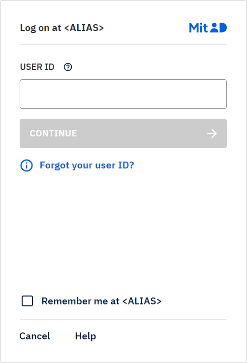

import Layout from '../../../../layouts/mdx';

export default Layout;

When setting up your MitID service provider, you are asked to pick an `alias`.

The MitID service provider alias will be displayed in the login box on web, and in the app when they approve the login/transaction.

