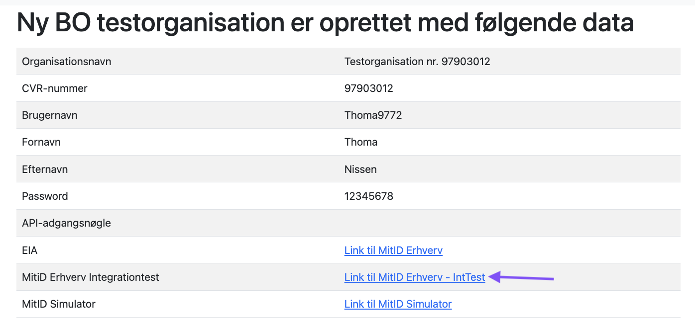
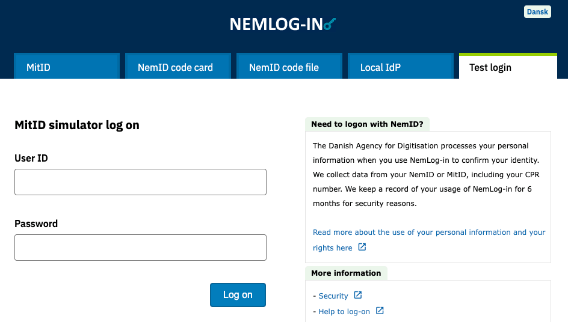
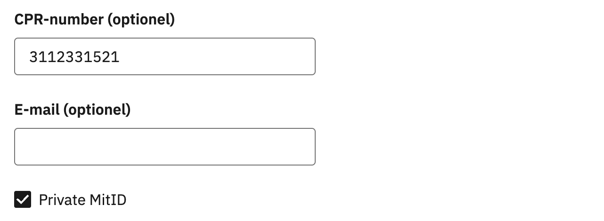
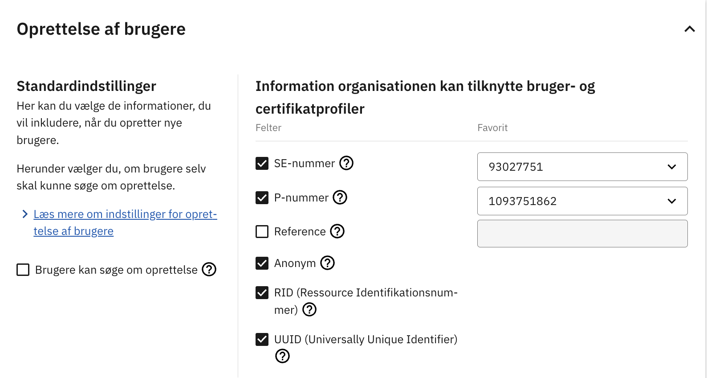
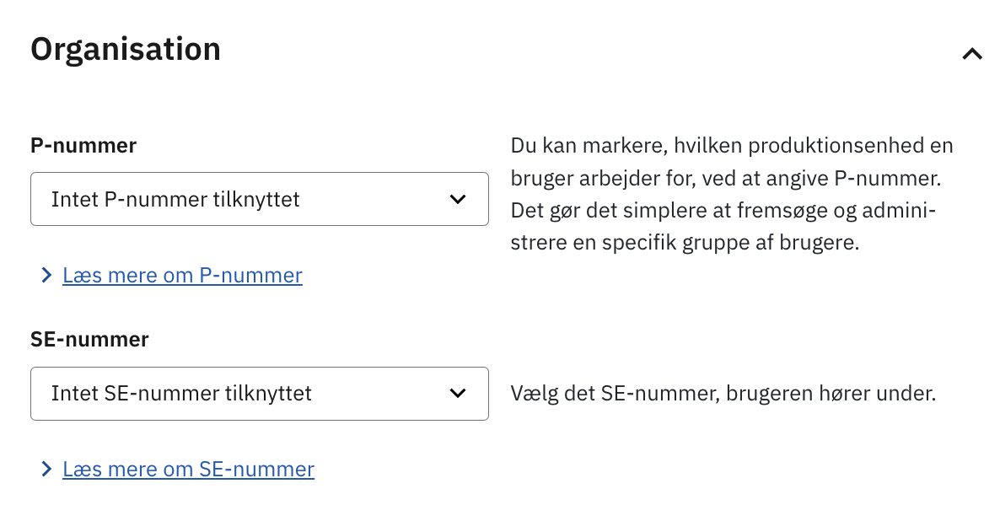
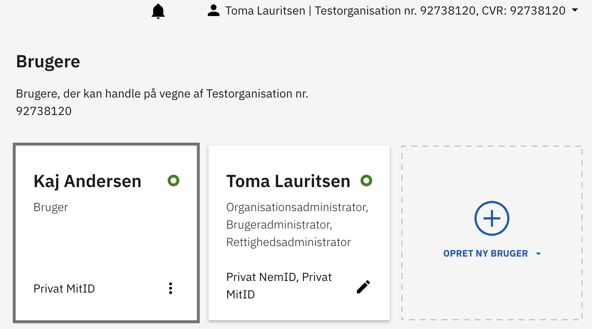

import {ImageContainer} from '../../../components/MdxProvider';
import DanishMitIDCompanySignatoryJwtSnippet from '../../../snippets/jwt-payloads/danish-mitid-erhverv-company-signatory';
import DanishMitIDErhvervJwtSnippet from '../../../snippets/jwt-payloads/danish-mitid-erhverv';

## Employees and company signatories
There are two kinds of business user roles in MitID: _employees_ and _company signatories_.
_Employees_ can be anyone who works at the company, and are registered by the company in MitID Erhverv.
_Company signatories_ are allowed to act on behalf of the company itself, and could e.g. be the CEO of a company.
A natural person can have both an _employee_ and a _company signatory_ role in the same company.

_Employees_ are registered in MitID Erhverv, and are looked up based on the MitID UUID.
_Company signatories_ can be registered in MitID Erhverv, but this is not mandatory.
For companies without MitID Erhverv, _company signatories_ are instead looked up in Erhvervsstyrelsen's systems.
This is done via the CPR number of the user.
So if you need _company signatories_, we will ask users for their CPR number when they log in with MitID Erhverv.

If you don't need _company signatories_, you can **Disable signatories for MitID business logins** in your Criipto Dashboard in **eID providers** > **Danish MitID**.

## JWT/Token examples

### MitID for company signatories

<DanishMitIDCompanySignatoryJwtSnippet />

### MitID Erhverv (MitID for business)

<DanishMitIDErhvervJwtSnippet />

The `sub`, `nameidentifier` and `uuid` values here will not be the same as for a corresponding [citizen-MitID login](/verify/e-ids/danish-mitid/#jwttoken-examples-mitid-citizen), even if the user chose to use their personal MitID for login.

## Collecting CPR numbers (optional)

Business users in MitID Erhverv (both _employees_ and _company signatories_) may not always have CPR numbers associated with their profiles.

CPR numbers are also not required for accessing information about the business entities where the user holds a position as an _employee_.
Criipto relies on the user's UUID to retrieve this information from the MitID Erhverv API.
Therefore, if you don't need CPR numbers in business logins, no additional configuration is required.
Note that if you need _company signatories_, we will ask users for their CPR number even if your application does not ask for them (see above).

If you do require CPR numbers, you can collect them by enabling the two toggles in the [management dashboard](https://dashboard.criipto.com/providers/DK_MITID):
- Add CPR for MitID logins
- CPR Optional

This feature can be useful in a scenario where you offer both MitID citizen logins and business logins, and [require CPR numbers for the citizen logins](/verify/e-ids/danish-mitid/#collecting-cpr-numbers).
Please note that it is only possible to collect CPR numbers for _company signatories_.
_Employee identities_ are legally distinct from the personal identity of the natural person, and it is not legal to correlate the two.

## Request business logins

You can request a login in business context via the following acr_values: `urn:grn:authn:dk:mitid:business`.  
Alternatively, you can send a `login_hint=business` or `login_hint=business_optional` query parameter in the authorize request.  
This will allow *company signatories* and *employees* to log in to your site or application with their personal MitID or their dedicated employee MitID (depending on how they have been setup in MitID Ervherv).

`login_hint=business` will allow logging in as a business user.  
`login_hint=business_optional` will give an option to choose to log in as a private individual, or a business user. 

You can read more about the [`login_hint` here](/verify/getting-started/oidc-intro/#the-loginhint-parameter).

You can determine which kind of option the user selected by inspecting the claim values in the JWT payload.
- Employee logins will have an `employee` claim with value `true`.
- Company signatory logins will have a `companySignatory` claim with value `true`.
- Private logins will have neither of the above.

### Prefill VAT ID (CVR number)

If you already have an expectation of what company the user will login on behalf of, you can prefill the VAT ID (CVR number)
to limit their selection choice (if multiple roles in the same company) or skip the company selector all together.

- When activating MitID Erhverv via acr_values: `urn:grn:authn:dk:mitid:business`: `login_hint=vatid:DK<CVR>`
- When activating MitID Erhverv via login_hint: `login_hint=business vatid:DK<CVR>`

## Test users

To test business logins with MitID Erhverv, you will start by [creating a test organization](/verify/e-ids/danish-mitid-erhverv/#create-test-organization) and [a test user](/verify/e-ids/danish-mitid-erhverv/#create-test-users), and then [connect the test user](/verify/e-ids/danish-mitid-erhverv/#connect-user-to-organization-as-an-employee) to the organization as an employee.

Detailed instructions, along with a [video demonstration](#video), are provided below to guide you through the process.

### Create test organization

1. Go to the test organization creation page and fill in the form: [https://testportal.test-devtest4-nemlog-in.dk/](https://testportal.test-devtest4-nemlog-in.dk/)

2. The wizard will generate an organization admin account with username/password credentials. The password is self-supplied, and the username is autogenerated.  
You can then follow the **Link til MitID Erhverv - IntTest** to login as the organization admin: 

3. Open the **"Test login" tab** and log in as the organization admin with username and password. 

4. After you login with the organization admin user, you will have access to the NemLog-in IdP (aka "EIA"): [https://erhvervsadministration.test-devtest4-nemlog-in.dk/](https://erhvervsadministration.test-devtest4-nemlog-in.dk/). There, you must explicitly enable the use of personal MitID (per organization) under Settings (Indstillinger => Identifikationsmidler).

### Create test users

Manually create a test user in both:
- <a href="https://pp.mitid.dk/test-tool/frontend/#/create-identity" target="_blank">MitID Test Tool</a>
- <a href="https://mitidsimulator.test-devtest4-nemlog-in.dk/Home/Create" target="_blank">MitID Simulator</a>

*Test users CAN HAVE the same user ID.*
*Test users MUST HAVE a CPR number, and it MUST BE the same in the 2 test-user creation tools listed above.*
When creating a test user <a href="https://mitidsimulator.test-devtest4-nemlog-in.dk/Home/Create" target="_blank">with MitID Simulator</a>, make sure to add a CPR number and check the Private MitID checkbox:

<Highlight icon="info">

In general, and most likely for MitID Erhverv production, CPR numbers are expected to be optional.

</Highlight>

### Connect user to organization as an employee

**Please note:** [creating test users](/verify/e-ids/danish-mitid-erhverv/#create-test-users) is a required step. The auto-generated admin user you created for a test organization CANNOT be used for employee login.

1. Once the test users are created, the organization admin can create an employee <a href="https://erhvervsadministration.test-devtest4-nemlog-in.dk/" target="_blank">in EIA</a>.

<Highlight icon="info">

When logged in as an admin user, you have the option to choose additional information to include when creating test users. For instance:

- SE number (administrative unit a user belongs to)
- P number (location a user is associated with)
- RID (Resource Identification Number)

This can be done under Settings (Indstillinger => Oprettelse af brugere):

If P and SE numbers are enabled for an organization after test users have been created, each user must be manually updated to get these values.  
This is done by editing the user configuration section, under "Organisation":

</Highlight>

2. An activation link will be sent to the specified employee email: follow the link to log in as an employee. You can use your personal email for both the organization admin and the employee email.  
_If you don't receive the activation email, you can <a href="https://erhvervsadministration.devtest4-nemlog-in.dk" target="_blank">log in to EIA</a> as an employee using the MitID tab. (You'll need to log out of your EIA admin account first, or use a different browser.)_  
If you followed the steps correctly, your EIA dashboard will look something like this:

3. If the organization admin has enabled use of personal MitID, the test employee can use their own test MitID for activation/onboarding, but a unique employee MitID username MUST BE specified during enrolment.

### Video

<video controls>
  <source src="https://www.criipto.com/hubfs/MitID%20Erhverv%20Test%20Users%20Video/test_user_mitid_erhverv.mp4" type="video/mp4" />
</video>
