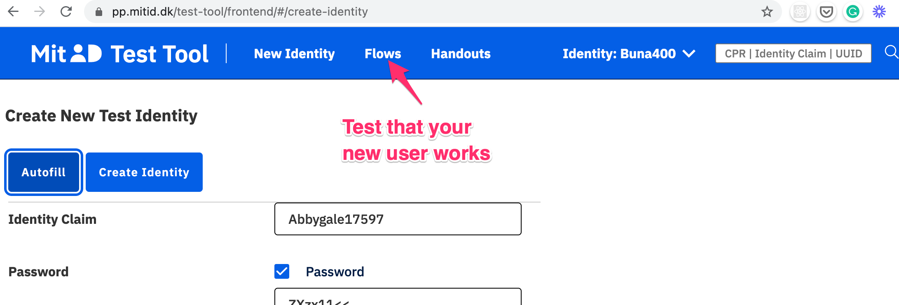
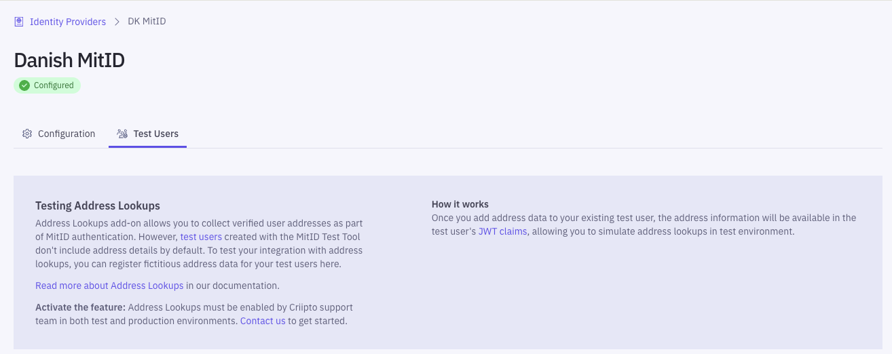
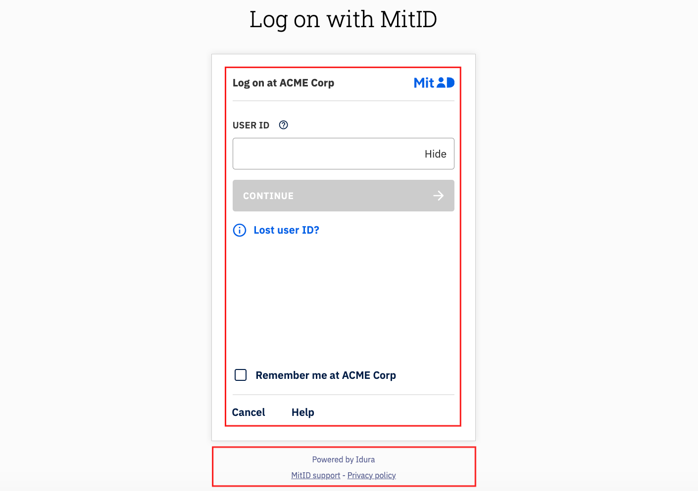
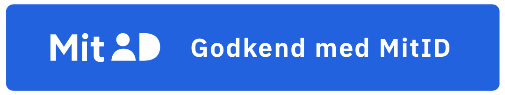
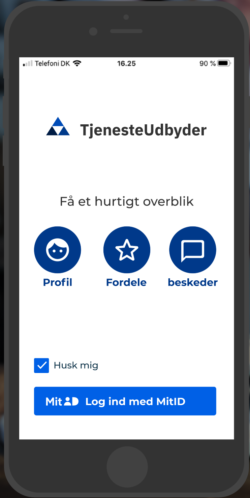
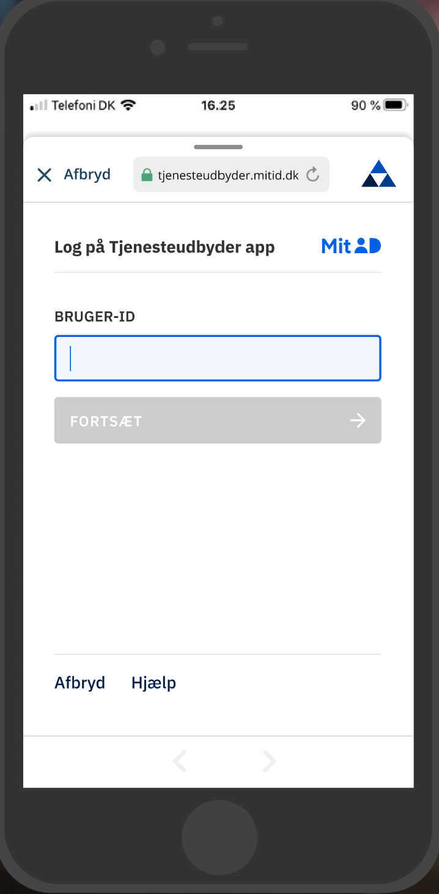

import { ImageContainer } from '../../../components/MdxProvider';
import ConsentRevocation from '../../../components/ConsentRevocation';
import DanishMitIDJwtSnippet from '../../../snippets/jwt-payloads/danish-mitid';
import DanishMitIDAddressJwtSnippet from '../../../snippets/jwt-payloads/danish-mitid-address';

## JWT/Token examples

### MitID for citizens

<DanishMitIDJwtSnippet />

### MitID for citizens (with address lookup)

[Address lookups](/verify/e-ids/danish-mitid/#collecting-user-addresses) are available as an add-on for MitID.

<DanishMitIDAddressJwtSnippet />

## Test users

You create personal MitID test users at [https://pp.mitid.dk/test-tool/frontend](https://pp.mitid.dk/test-tool/frontend):

1. Just use the autofill button and then change the details to your liking.
2. If you haven't done so already, install the test app from [https://pp.mitid.dk/mitid-app/index.html](https://pp.mitid.dk/mitid-app/index.html)
   _**Note:** On iOS, you can install both the test and production versions of the MitID app on the same device. On Android, the two versions cannot coexist, so you'll need a separate device for testing._
3. You can test your new users by using the "Flows" menu at the top of the screen.



<Highlight icon="info">

To create MitID Erhverv users, [follow these steps](/verify/e-ids/danish-mitid-erhverv/#test-users).

</Highlight>

### Adding address data to a test user

To test [address lookups](/verify/e-ids/danish-mitid/#collecting-user-addresses), you can add fictitious address data to your test user via the Dashboard.
Navigate to **Identity Providers** > **DK MitID** > **Test Users**, and register your test user with a new address.


<Highlight icon="info">

Note: To access this feature, you must first fill in the MitID application form at **Identity Providers** > **DK MitID**.

</Highlight>

## Collecting CPR numbers

You must enable the "Add CPR for MitID logins" toggle in the [management dashboard](https://dashboard.criipto.com/providers/DK_MITID).
Idura Verify will prompt the user for their CPR number and validate that it belongs to the MitID user that is logging in.

For applications configured to use a `static` `scope` strategy, the CPR will be added to the issued token.

For applications configured to use a `dynamic` `scope` strategy, supply `scope=openid ssn` in the authorize request.

Idura provides users with the option to store their CPR number for 1 year, after which the user must provide explicit CPR consent again.

<Highlight icon="info">

Idura stores CPR numbers in encrypted format. The consent is per-tenant only.

</Highlight>

<ConsentRevocation />

## Collecting user addresses

If you collect the users CPR number, the users current address can also be made available.

Data processor and dedicated billing agreements are needed, contact sales@idura.eu for the legal and financial arrangements.

For applications configured to use a `static` `scope` strategy, address data will automatically be added.

For applications configured to use a `dynamic` `scope` strategy, supply `scope=openid address` in the authorize request.

To test your integration with address lookups, [add address data to your test user](/verify/e-ids/danish-mitid/#adding-address-data-to-a-test-user).

<Highlight icon="file-lines">

If you do not also request the `ssn` scope, Idura Verify will query the user for the CPR number anyway, as this is needed to look up the users address.

The CPR number _will not_ be issued in the JWT in this case, even if the user was prompted for it during login.

</Highlight>

### Example (partial) authorize request with scope

```text
https://YOUR_SUBDOMAIN.idura.broker/oauth2/authorize?scope=openid address&...
```

Alternatively, you can send it in the `login_hint`

```text
https://YOUR_SUBDOMAIN.idura.broker/oauth2/authorize?...&login_hint=scope:address&...
```

which can be a useful if you are working with technology that does not let you control the `scope` value.

## Reference message

MitID allows you to choose a reference message which will be display to the user in the MitID app while they perform the authentication.
For instance, the text could be something like `Transfer EUR 100 to account 1234`.
The message is limited to a length of 130 characters.

To provide a reference message text, you must provide [the `message` login hint](/verify/getting-started/oidc-intro/#end-user-confirmation-texts-message-parameter) in your authorize request. The reference message text must be base64 encoded.
Example:

```text
https://YOUR_SUBDOMAIN.idura.broker/oauth2/authorize?...&login_hint=message:TG9naW4gYXQgVGVzdCBDb21wYW50...
```

[Authorize URL builder example](/verify/guides/authorize-url-builder/?acr_values=urn:grn:authn:dk:mitid:low&action=approve&message=Transfer%20EUR%20100%20to%20IBAN%20DK123456781234)

## ReAuthentication

MitID supports a "ReAuthentication" flow where the username input step can be skipped if you know the users uuid ahead of time.

`login_hint=uuid:<uuid>` to trigger re-authentication when UUID is known.

## Controlled Transfer

MitID supports transferring authenticated users from one service provider to another without requiring additional authentication.
This is called a Controlled Transfer.
Controlled Transfers require that you partner with each service provider that you would like to transfer users to or from, since it is up to the service providers themselves to coordinate the transfer.

<Highlight icon="exclamation" warning>

It is your responsibility to obtain consent from the end user to transfer the MitID claims (such as their name and CPR number) obtained in the initial authentication to the receiving service provider.
All claims present in the original JWT will be transferred to the receiving service provider.

</Highlight>

To enable Controlled Transfer for a session, you must provide `login_hint=dk:mitid:ct` for the initial authentication.
This will add two additional claims, `mitid:ct:sid` and `mitid:ct:sid:exp`, in the JWT we issue once the user is authenticated.

The `mitid:ct:sid` claim contains a session token which allows you to initiate Controlled Transfers.
You must store this token securely.

The `mitid:ct:sid:exp` claim contains the time when the session token expires.
After this time, it is no longer possible to perform a Controlled Transfer for the session.
We suggest that you instead use the ReAuthentication flow to transfer the user if the session token has expired.

To initiate a Controlled Transfer, send a `POST` request to

```text
https://{YOUR_IDURA_DOMAIN}/DkMitId/ControlledTransfer
```

containing the following information in JSON format:

```text
{
  "targetBrokerId": "",
  "targetServiceProviderId": "",
  "transferTokenText": "",
  "mitIdControlledTransferSessionId": ""
}
```

- `targetBrokerId` must contain the MitID broker ID of the broker used by the service provider you are sending the user to
- `targetServiceProviderId` must contain the MitID service provider ID of the service provider you are sending the user to
- `transferTokenText` is a free text field (with a maximum length of 130 characters) that you can use to pass information to the service provider you are sending the user to
- `mitIdControlledTransferSessionId` must contain the session token obtained from the `mitid:ct:sid` claim in the JWT issued when the user first authenticated using MitID

You must obtain both the `targetBrokerId` and the `targetServiceProviderId` from your partner service provider.
Note that the broker ID and service provider ID will differ between test environments and production.
If the `targetBrokerId` and `targetServiceProviderId` do not match the service provider attempting to complete the Controlled Transfer, the transfer will fail for security reasons.

The `transferTokenText` can e.g. be used to send a hash of any additional information you have sent to your partner service provider via other channels to prove that the additional information has not been tampered with.
You must coordinate any use of the `transferTokenText` with your partner service provider.

If the request above is successful, you will receive a JSON response containing a Controlled Transfer Token Exchange Code in the field `transferTokenExchangeCode`.
The Controlled Transfer Token Exchange Code is a one-time token which can be used by your partner service provider to complete the Controlled Transfer in collaboration with their MitID broker.
The Controlled Transfer Token Exchange Code must be stored securely.
You and your partner service provider must coordinate how you will send them the Controlled Transfer Token Exchange Code.

Idura currently only supports outbound Controlled Transfers, i.e. sending users from your service to another service.
Please contact us if you would like to use inbound Controlled Transfers.

## Levels of assurance

MitID via Idura offers all three levels of assurance via the acr_values `urn:grn:authn:dk:mitid:low` + `urn:grn:authn:dk:mitid:substantial` + `urn:grn:authn:dk:mitid:high`.

If in doubt, our recommendation would generally be to go with Substantial (`urn:grn:authn:dk:mitid:substantial`).

[Read more about eIDAS Levels of Assurance](https://ec.europa.eu/digital-building-blocks/wikis/display/DIGITAL/eIDAS+Levels+of+Assurance)

### High

`urn:grn:authn:dk:mitid:high` allows users to login with username and either of

- MitID app if it is enrolled with level `high`
- Password + MitID Chip
- MitID app if it is enrolled with level `high` + MitID Chip

### Substantial

`urn:grn:authn:dk:mitid:substantial` allows users to login with username and either of

- MitID app
- MitID code display
- Any authenticator on level `high`.

### Low

`urn:grn:authn:dk:mitid:low` allows users to login with username and either of

- Password
- Any authenticator on levels `high` and `substantial`

## MitID for business ('MitID Erhverv')

You can find the details regarding MitID Erhverv [here](/verify/e-ids/danish-mitid-erhverv/).

## Order MitID for production

<Highlight icon="file-lines">

**Prerequisites for ordering**

In order to apply for MitID in production on behalf of a company you must meet the basic requirements:

- Your company must be registered in the EU and have an EU VAT Id.
- The person applying must be enrolled in MitID Erhverv for your company, or be a signatory of the company.
- You must have completed step 4 in the [Getting ready for production](/verify/guides/production) guide. You will need the production domain to complete the order for your client credentials.

</Highlight>

### MitID terms of service

In addition to the general [Idura terms of service](https://criipto.com/legal/tos/), you must also accept the [MitID specific terms](https://criipto.com/legal/mitid/tos).

### UX requirements

With MitID you will be using a hosted MitID page at Idura. The page may be styled to your liking, but some requirements must be
observed.

Please [see the UX requirements](#mitid-user-interface-requirements) to make sure you comply.

### Apply for production access

#### Companies registered in Denmark

If your company is registered in Denmark please follow these steps:

1. Go to the [management dashboard](https://dashboard.criipto.com) and set the environment toggle at the top center to "PRODUCTION".
2. In the "Identity sources" section, expand the "DK MitID" section
3. A user enrolled in MitID Erhverv must click the button and sign in.
4. Submit the details for your company. Note the following:

- The name to show in the MitID login box is the name entered in the "Company alias" box

5. Press complete when everything is filled out as you like.
6. Your company will now be created as a Service Provider with Nets, this takes approximately 15-20 minutes, then you can start to use MitID for production logins.

#### Companies not registered in Denmark

If your company is _not_ registered in Denmark, meaning you don't have MitID Erhverv, please send a request for MitID onboarding to [orders@idura.eu](mailto:orders@idura.eu). The process typically takes 2-3 business days.

#### Apply for a custom MitID domain

1. Go to the "Identity sources" section and open "DK MitID"
2. At the bottom of the page you will find a button where you can apply for a custom MitID domain
3. The "Domain prefix" is typically your company or brand name, e.g. acme-corp. Once this registration is completed this will be used to set up your MitID domain, in this case acme-corp.mitid.dk.
4. The information is sent to Nets who will setup your MitID Domain.

- Expect this process to take 7-15 work days.
- Once your domain has been set up, you can complete the onboarding process (read below)

#### Complete the custom MitID domain process

Once you receive a confirmation from Idura (via email), go back to the "Identity sources" section and open "DK MitID". Nets has now set up the `mitid.dk` domain, and the **Complete** button will be active for you to click.

1. Click the **Complete** button in the MitID section to finish the registration process
2. Configure the various options that appear after the onboarding completes.
   - If you need access to the end-user's CPR number, make sure the `Add CPR for MitID logins` toggle is enabled.
   - Not all MitID users have a CPR number. If your application can handle the case of a missing CPR, you may enable the `CPR Optional` toggle. This will let MitID users without a CPR number log in to your service.

### Set up an application on your MitID domain

Register [your application](/verify/getting-started/basics/#applications), just as you would for all other integrations.

## Validating token signatures for MitID

MitID comes with a new approach to storing and using token signing keys. There will be a distinct token signing key in use for MitID, in addition to the one you use for other types of eIDs. Idura Verify announces all of these signing keys in the metadata documents for your domains (see [work with metadata](/verify/guides/work-with-metadata/) for a primer on this subject).

Most modern OIDC libraries have built-in support for dynamic metadata retrieval, so all this should be handled for you behind the scenes.

Dynamic metadata retrieval is also necessary to achieve minimal disruption for your applications in an ordinary key rollover as well as disaster recovery scenarios.

## MitID user interface requirements

When supporting MitID in your application, you must adhere to a few style requirements, both [in your application](#mitid-branding-in-your-application)
and on [the MitID landing page](#the-mitid-landing-page) hosted by Idura.

As long as you follow the guidelines below, you should be in compliance with the UX requirements from MitID. However, please reach out to our support if you need assistance verifying that your buttons, pages, and screens comply.

<Highlight icon="file-lines">

Note that when moving to production with MitID you will be bound by the terms of service for MitID in which you - among other things - commit to the below UX requirements.

Also, Idura may request that you submit a URL where we can verify that you are, in fact, in line with the requirements.

</Highlight>

### The MitID landing page

With MitID everything happens on a page hosted by Idura. Specifically, MitID cannot be iframed, only shown in full page view.

You will therefore redirect the current page to Idura (alternatively, [open a browsing component](#mitid-branding-in-a-native-app) in a native app), or you may open up a popup window. The latter is only relevant on the desktop and is typically not recommended by Idura.

In the test environment, the MitID landing page will be hosted on an Idura-provided domain: `criipto.pp.mitid.dk`. In production, you will [apply for your own domain](#apply-for-production-access).

#### Styling the landing page

In general, the landing page for MitID may styled by following [the general guide on styling](/verify/guides/custom-styling). In essence, you can modify the page any way you like using CSS.

As illustrated below, the default landing page has the MitID box - the red rectangle - at the center.
It is essential that you do not, under any circumstances, change the styling or layout of anything inside the red rectangle.
The _required_ minimum height of the MitID box is 588 pixels, and it is _strongly recommended_ that you always allow the MitID UI elements to fill out the entire viewport width on mobile devices.

It is also _required_ to keep the "Powered by Idura" text and the links to MitID Support and Privacy Policy - the red rectangle below the MitID box.



### MitiD branding in your application

When referring to MitID in your application, web or native alike, you must make sure your language and styling matches the requirements.

If you are building a native app a few additional requirements must be observed as [described below](#mitid-branding-in-a-native-app).

<Highlight icon="file-lines">

Download the required assets, the MitID logo and fonts, [directly from our web site](/MitID-assets.zip).

</Highlight>

#### Call to Action

When providing a call to action, for example, log in or sign, make sure you follow these requirements:

- In web applications, always use a button or anchor tag, `<a>` or `<button>`, to make sure it is accessible for keyboard navigation and screen readers according to the WCAG 3.0 standard.
- The button must be the right color of blue with the white text. See the detailed styling below.
- The button text must be exactly one of the five allowed phrases as listed below.

The MitID button should be shown with lightly rounded corners:

<ImageContainer maxWidth={300}>



</ImageContainer>

The key elements of the default styling are shown below, but we suggest to simply inspect the buttons in the MitID applet and copy the corresponding styles.

```css
{
    background: #0060e6;
    color: #ffffff;
    font-family: "IBM Plex Sans", Helvetica, Arial, sans-serif;
    border-radius: 4px;
    height: 48px;
    padding: .25rem .75rem .25rem 1rem;
}
```

The text inside the button must be from the set of approved texts:

<table>
  <thead>
    <tr>
      <th>**Danish**</th>
      <th>**English**</th>
    </tr>
  </thead>
  <tbody>
    <tr>
      <td>Log ind med MitID</td>
      <td>Log on with MitID</td>
    </tr>
    <tr>
      <td>Godkend med MitID</td>
      <td>Approve with MitID</td>
    </tr>
    <tr>
      <td>Bekræft med MitID</td>
      <td>Confirm with MitID</td>
    </tr>
    <tr>
      <td>Acceptér med MitID</td>
      <td>Accept with MitID</td>
    </tr>
    <tr>
      <td>Underskriv med MitID</td>
      <td>Sign with MitID</td>
    </tr>
  </tbody>
</table>

### MitID branding in a native app

Just as illustrated above, your app must show a call to action which must open a MitID-compatible browsing component to host the MitID landing page:

<ImageContainer maxWidth={300}>



</ImageContainer>

Your app must use a platform-specific, MitID-compatible browsing component which clearly reassures the user that they are on a legitimate mitid.dk domain with appropriate security (TLS and the padlock symbol):

<ImageContainer maxWidth={300}>



</ImageContainer>

<Highlight icon="info">

You can read more about the details of [MitID-compatible browsing components here](/verify/guides/appswitch/#danish-mitid).

</Highlight>
