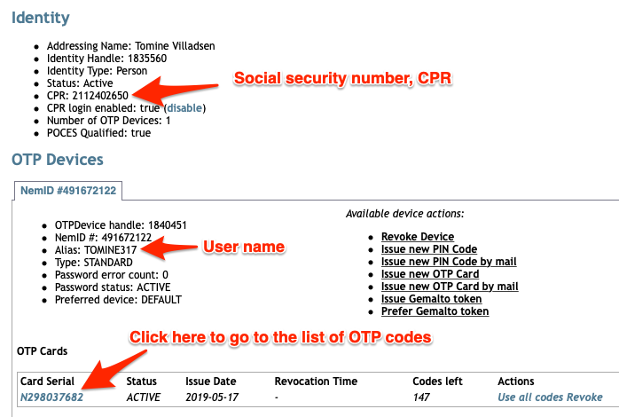

import Layout from '../../../layouts/mdx';
import ConsentRevocation from '../../../components/ConsentRevocation';
import JwtPayloadViewer from '../../../components/JwtPayloadViewer';

export default Layout;

## JWT/Token examples

### NemID for citizens (POCES)

<JwtPayloadViewer
  payload={
    {
      "identityscheme": "dknemid",
      "nameidentifier": "fc9b7dedfe674fdda97d8dc9079c6403",
      "sub": "{fc9b7ded-fe67-4fdd-a97d-8dc9079c6403}",
      "pidNumberIdentifier": "9208-2002-2-294247448400",
      "isYouthCert": "false",
      "companySignatory": "false",
      "cprNumberIdentifier": "0707490071",
      "name": "Terne Paulsen",
      "country": "DK",
      "2.5.4.5.1": "PID:9208-2002-2-294247448400",
      "2.5.4.5": "5CE82384",
      "2.5.29.29": "CN=TRUST2408 Systemtest XXXIV CA, O=TRUST2408, C=DK"
    }
  }
/>

Also, you may additionally opt-in to having and `address` lookup enabled. This will add the following property to the payload:

<JwtPayloadViewer
  payload={
    {
      "identityscheme": "dknemid",
      "nameidentifier": "fc9b7dedfe674fdda97d8dc9079c6403",
      "sub": "{fc9b7ded-fe67-4fdd-a97d-8dc9079c6403}",
      "pidNumberIdentifier": "9208-2002-2-294247448400",
      "isYouthCert": "false",
      "companySignatory": "false",
      "cprNumberIdentifier": "0707490071",
      "name": "Terne Paulsen",
      "country": "DK",
      "2.5.4.5.1": "PID:9208-2002-2-294247448400",
      "2.5.4.5": "5CE82384",
      "2.5.29.29": "CN=TRUST2408 Systemtest XXXIV CA, O=TRUST2408, C=DK",
      "address": {
        "formatted": "Terne Paulsen\nDuevej 11\n2000 Frederiksberg",
        "common_name": "Terne Paulsen",
        "street_address": "Duevej 11",
        "postal_code": "2000",
        "city": "Frederiksberg",
        "locality": null,
        "region": null,
        "country": "Danmark"
      }
    }
  }
/>

Existence of this field is not guaranteed, even if the you have opted in to lookup.

### NemID for company signatories (POCES-with-CVR)

<JwtPayloadViewer
  payload={
    {
      "identityscheme": "dknemid",
      "nameidentifier": "fc9b7dedfe674fdda97d8dc9079c6403",
      "sub": "{fc9b7ded-fe67-4fdd-a97d-8dc9079c6403}",
      "pidNumberIdentifier": "9208-2002-2-294247448400",
      "isYouthCert": "false",
      "companySignatory": "true",
      "cprNumberIdentifier": "0707490071",
      "cvrNumberIdentifier": "35389253 ",
      "2.5.4.10": "Hillemann Hessel Holding ApS",
      "name": "Terne Paulsen",
      "country": "DK",
      "2.5.4.5.1": "PID:9208-2002-2-294247448400",
      "2.5.4.5": "5CE82384",
      "2.5.29.29": "CN=TRUST2408 Systemtest XXXIV CA, O=TRUST2408, C=DK"
    }
  }
/>

### NemID for employees (MOCES)

<JwtPayloadViewer
  payload={
    {
      "identityscheme": "dknemid",
      "nameidentifier": "c79c9cde000a4460b64ecb35730ee2bc",
      "sub": "{c79c9cde-000a-4460-b64e-cb35730ee2bc}",
      "ridNumberIdentifier": "72131748",
      "cvrNumberIdentifier": "31884357",
      "2.5.4.10": "HORSOSOFT ApS // CVR:31884357",
      "companySignatory": "false",
      "name": "PutandTrackTest",
      "country": "DK",
      "2.5.4.5.1": "CVR:31884357-RID:72131748",
      "2.5.4.5": "5BAD00A0",
      "2.5.29.29": "CN=TRUST2408 Systemtest XXII CA, O=TRUST2408, C=DK"
    }
  }
/>

No social security number in this case, but the combination of `cvrNumberIdentifier` and `ridNumberIdentifier` identifies the legal person corresponding to the login.

## Test users

For personal NemID test users, you may create them at [https://appletk.danid.dk/testtools](https://appletk.danid.dk/testtools/). Login in with username `oces` and password `nemid4all`.  Don't worry about the message about not being supported. 

_First_, note that you can search out already created test users by filling out the search field at the top of that page. This may be convenient if you've lost the link to the user page.

If you just need to do a quick login test, you may use this test user instead of going throught the steps below: [https://appletk.danid.dk/testtools/viewstatus.jsp?userid=TOMINE317](https://appletk.danid.dk/testtools/viewstatus.jsp?userid=TOMINE317). (If all the OTP codes have been used, just issue a new OTP card, but click the link for that.)

That said the steps to create a test user are fairly simple:

1. Scroll to the bottom and click the "Autofill" button
2. _Important_. Remember to check the checkbox that says "Activate". If you don't you can't use the test user
3. Take note of the password - or set your own.
3. Click "Submit"
4. Don't worry if you see the same form again. At the bottom you have a Java exception: `java.lang.NullPointerException` in red
5. Copy the "Alias" or the "CPR" and search for it using the "View existing idenity" search field at the top
6. Now you will see the page with all the details for the user.



### Test users for employees (medarbejder-signatur)

The current OTP card(s) can be accessed on the same testtools-site as above.

Unfortunately, it is not possible to use the testtools-site to create your own test-employee users.
If you need to have your own test-MOCES accounts created, you must contact NETS directly.

## Collecting CPR numbers
You must enter a PID-CPR agreement with NETS in conjuction to your NemID TU agreement, and enter your SPID in the "SPID for PID/CPR service" field in the [management dashboard](https://dashboard.criipto.com/providers/DK_NEMID).
Criipto Verify will prompt the user for their CPR number and validate that it belongs to the NemID user that is logging in.

For applications configured to use a `static` `scope` strategy, the CPR will be added to the issued token.

For applications configured to use a `dynamic` `scope` strategy, supply `scope=openid ssn` in the authorize request.

Criipto provides users with the option to store their CPR number for 1 year, after which the user must provide explicit CPR consent again.

<Highlight icon="info">

Criipto stores CPR numbers in encrypted format. The consent is per-tenant only.

</Highlight>

<ConsentRevocation />

## Collecting user addresses
If you collect the users CPR number, the users current address can also be made available. Address lookups incur an additional charge.

Data processor and dedicated billing agreements are needed, contact sales@criipto.com for the legal and financial arrangements. 

For applications configured to use a `static` `scope` strategy, address data will automatically be added.

For applications configured to use a `dynamic` `scope` strategy, supply `scope=openid address` in the authorize request.

<Highlight icon="file-lines">

If you do not also request the `ssn` scope, Criipto Verify will query the user for the CPR number anyway, as this is needed to look up the users address.

The CPR number _will not_ be issued in the JWT in this case, even if the user was prompted for it during login.

</Highlight>

### Example (partial) authorize request with scope
```
https://YOUR_SUBDOMAIN.criipto.id/oauth2/authorize?scope=openid address&...
```
Alternatively, you can send it in the `login_hint`
```
https://YOUR_SUBDOMAIN.criipto.id/oauth2/authorize?...&login_hint=scope:address&...
```
which can be a useful if you are working with technology that does not let you control the `scope` value.

## Order NemID for production

To start accepting real users with Danish NemID, you must first enter into a service provider agreement (Danish: "Tjenestedudbyderaftale") with Nets, the operator of NemID.

### Prerequisites before setting up an agreements

In order to become a NemID service provider, your organisation must meet a few basic requirements:

- Your company must registered in the central Danish business registry and be issued a orgnisational id, a CVR number.
- There must be a NemID administrator already in your organisation, a socalled _LRA_. All Danish companies have one.

### Filling out the agreement

First of all [follow the guide](https://www.nets.eu/dk-da/kundeservice/nemid-tjenesteudbyder/bestilling) provided by Nets.  It takes you through the 4 steps and includes the relevant download links etc.:

1. Order a company certificate ("Virksomhedssignatur")
2. Fill out the online service provider agreement ("Tjenesteudbyderaftale"). This form includes a download link for the CPR agreement in the next step.
3. Download and fill out the CPR agreement form ("PID/RID cpr-tjenesterne"), sign it, and attach it to the service provider agreeement.
4. Attach the CPR agreement to the online service provider agreement and send it

As you fill out the forms please check the section below for a few details related to the Criipto Verify service.

### Criipto Verify related notes

When filling out the online sevice provider agreement keep this in mind:

- _Forbrugsafregning_ (consumption billing). You will be billed directly by Nets based on your choice in this section. Criipto _does not_ act as a NemID reseller and we cannot bill you you consumption of the raw NemID service.
- _Opsætning_ (setup). This section has a few important details:
    - _Friendly name_. As the form explains this is the name that will appear in the NemID client. _Important:_ Note that this name must also be entered in the Criipto Verify management UI for our integration with Nets to work!
    - _Virksomhedssignatur UID-nummer_ (part of company certificate subject name). This information is found in the [NemID administration](https://www.medarbejdersignatur.dk/produkter/nemid_medarbejdersignatur/log_paa_nemid_selvbetjening/). Look under "Øvrige signaturer -> Administrer virksomhedssignatur".
- _Aftale om brug af PID/RID cpr-tjenesten_ (CPR agreement). If you need social seurity numbers, CPR, you need to pick one or more of these options. Unless you are a goverment organisation you choices will be the _-match_ services. _PID_ is for personal NemID, _RID_ is for employee NemID.
    - This is where you download, fill out and sign the CPR agreement, and attach it
_​Opsætning af testsystem_ (setup of test system). Answer _yes_ here only if you need to be able to generate test users for NemID employee signatures, MOCES.
- _IP-adresser_. You may enter a set of IP addresses for access to the test and development environments. These must be the IP addresses you use to connect from (use for example [MyIP.com](https://www.myip.com/)). _Note that this is not necessary_ to use Criipto Verify, as we are already registered. But if you have a set of fixed IP adresses, you may enter them just to gain access to the tool needed to generate test users for employee signatures.

That's basically it. Once you've filled out and submitted the service provider agreement form, you will, typcically after a week or so, receive an email with the details you need to start using production NemID. Use this information and the company certificated to configure Criipto Verify as described below.

### Setting up Criipto Verify for NemID for production

Keep and eye out for an email from Nets with the details of your NemID service provider agreement. It should be sent from `tu-support@nemid.nets.eu` with a subject "RE: Bestilling af NemID tjenesteudbyder". In that email you will need the production informtion listed _after_ the test details.

Now fill matching fields in the Criipto Verify UI:

1. Switch the toggle in the UI to "Production environment"
2. Locate and upload the company certificate, the "Virksomhedssignatur", you ordered and received before starting the service provider process. The password is the one you picked when you downloaded the certificate from Nets.
3. Enter the SPID for PID/CPR as listed in the email from Nets. Make sure you use the one from the production section closer to the bottom of the email.
4. Enter the friendly name exactly as listed in the email.

That's - finally - it! You have ordered, received, and configured the necessary information and certificates to start accepting real NemID logins and signatures.

### Next steps

You are now ready to set up your application to use real NemID in production. Please refer to the [guide on how to move to production](/verify/guides/production).