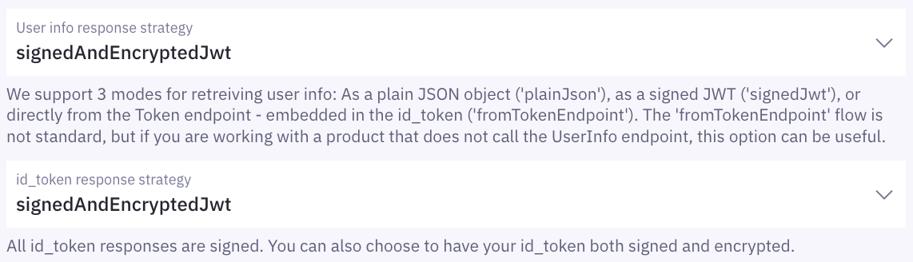

import FtnJwtSnippet from '../../../snippets/jwt-payloads/finnish-trust-network';

## The FTN Security Requirements

<Highlight icon="exclamation" warning>

The Finnish government has introduced new requirements to increase the level of security and privacy of FTN authentication.
The requirements are described in <a href="https://www.kyberturvallisuuskeskus.fi/sites/default/files/media/file/Traficom_S213_2023_OIDC_Profile_v2_2_for_the_Finnish_Trust_Network_EN.pdf" target="_blank">Recommendation 213/2023 S Finnish Trust Network OpenID Connect Profile</a> and include:

1. Private Key JWT client authentication
2. Authentication request signing
3. Encrypted `token` and `userinfo` responses
4. Statically configured JWK sets for signing and encryption

Client applications must be able to fulfill the new requirements to continue offering FTN logins, regardless of the chosen FTN broker.

Requirements went into effect on August 31, 2025.

### Technical guides

Technical guides for each requirement are provided below:

- [Private Key JWT client authentication](/verify/e-ids/finnish-trust-network/#private-key-jwt-client-authentication)
- [Authentication request signing](/verify/e-ids/finnish-trust-network/#authentication-request-signing)
- [Encrypted token and userinfo responses](/verify/e-ids/finnish-trust-network/#encrypted-token-and-userinfo-responses)
- [Statically configured JWK sets](/verify/e-ids/finnish-trust-network/#statically-configured-jwk-sets-for-signing-and-encryption)

Should you encounter any challenges or need further assistance, please do not hesitate to reach out to our support team at [support@idura.eu](mailto:support@idura.eu) or via [Slack](https://tiny.cc/criipto-slack).

</Highlight>

### Private Key JWT client authentication

Your application must use `private_key_jwt` client authentication instead of `client_secret` to authenticate to Idura.

Please refer to the [Private Key JWT authentication guide](/verify/guides/privatekey-jwt/) for instructions on configuring `private_key_jwt` client authentication. Note that FTN requires:

- Statically configured JWK sets.
- A `kid` in the JWT header of the `client_assertion`.
- The `jti` claim included in the `client_assertion`.

### Authentication request signing

Your application must sign [authorization requests](/verify/getting-started/glossary/#authorization-request-authorize-url) to Idura and send them as JWT-secured Authorization Requests(JARs).
A JWT-secured Authorization Request is a method where the [request parameters](/verify/getting-started/oidc-intro/#authorize-request-parameters) are encapsulated in a [JSON Web Token (JWT)](/verify/getting-started/glossary/#json-web-token-jwt) signed by your application’s private key and included in the authorization request via the `request` parameter.

Authentication request signing enhances security by guaranteeing that the request originated from your application and has not been tampered with. To understand the benefits in more detail, see: <a href="https://www.criipto.com/blog/signed-authorization-requests" target="_blank">Why Signed Authorization Requests Elevate Your Security</a>.

#### Creating a signed authorization request

To create a signed authorization request, you first create a JWT where the payload contains your [request parameters](/verify/getting-started/oidc-intro/#authorize-request-parameters), plus appropriate `issuer` and `audience`.
The JWT is then signed using your application's private signing key and added to the authorization request via the `request` parameter. The private signing key used for [private key JWT client authentication](/verify/e-ids/finnish-trust-network/#private-key-jwt-client-authentication) can be used to sign authorization requests.

Your signed authorization request will look something like this:

`https://acme-corp.idura.broker/oauth2/authorize?client_id=your_client_id&request=eyJhbGciOiJNilhcmxzZXYifQ.eyJpc3MiOiJ5b3VyX2Nsa9pZCI...`

where the only two parameters directly included in the URL are:

- `client_id`: contains the Client ID of your Idura application
- `request`: contains Request Object (the JWT whose claims hold the JSON-encoded authorization request parameters)

The code sample below demonstrates creating a Request Object JWT, then building authorize URL in a Node.js/Express application.

```javascript
import * as jose from 'jose';

// Generate a signed JWT (Request Object)
const createSignedRequestObject = async signingKey => {
  // Define parameters for your authorization request
  const requestObjectPayload = {
    response_mode: 'query',
    response_type: 'code',
    client_id: CLIENT_ID,
    redirect_uri: REDIRECT_URI,
    state: state,
    scope: 'openid',
    login_hint: 'enforce_ftn_requirements', // optional login_hint used to test a request for compliance with FTN requirements
  };

  // Create and sign the JWT
  const signedJwt = await new jose.SignJWT(requestObjectPayload)
    .setProtectedHeader({
      alg: 'RS256',
      kid: SIGNING_KEY_KID,
    })
    .setIssuer(CLIENT_ID)
    .setAudience(`https://${IDURA_DOMAIN}`)
    .sign(signingKey);

  return signedJwt;
};

// Example usage in an Express route
app.get('/login', async (req, res) => {
  try {
    const privateSigningKey = 'YOUR_SIGNING_KEY_HERE';
    const requestObject = await createSignedRequestObject(privateSigningKey);

    // Build authorize URL
    const authorizeUrl = `https://${IDURA_DOMAIN}/oauth2/authorize?client_id=${CLIENT_ID}&request=${requestObject}`;

    res.redirect(authorizeUrl);
  } catch (error) {
    console.error('Error during login:', error);
    res.status(500).send('Login failed.');
  }
});
```

### Encrypted token and userinfo responses

Idura will apply [JSON Web Encryption (JWE)](/verify/getting-started/glossary/#json-web-encryption-jwe) to secure `token` and `userinfo` responses resulting from FTN authentication.
This means that after a successful [code-for-token exchange](/verify/getting-started/glossary/#code-exchange), the `id_token` (and `userinfo` if requested) will be sent to your application in a JWE format, rather than a standard [JWT](/verify/getting-started/glossary/#json-web-token-jwt).
These JWEs are encrypted using your application's public encryption key, requiring you to use the corresponding private key to decrypt them.

For a deeper dive into JWE, please refer to our blog posts:

- [An Introduction to JSON Web Encryption](https://www.criipto.com/blog/json-web-encryption-introduction)
- [Securing Authentication Flows with JSON Web Encryption](https://www.criipto.com/blog/jwe-encrypted-responses)

To configure your application to handle encrypted `token` and `userinfo` responses, follow the steps below:

**1. Generate a new key pair**

FTN requires that you use different key pairs for signing and encryption. Therefore, you'll need to generate a separate key pair for encryption, distinct from the one used for [Private Key JWT authentication](/verify/e-ids/finnish-trust-network/#private-key-jwt-client-authentication) and [authentication request signing](/verify/e-ids/finnish-trust-network/#authentication-request-signing).

```javascript
import * as jose from 'jose';

async function generateEncryptionKeyPair() {
  try {
    const { publicKey, privateKey } = await jose.generateKeyPair('RSA-OAEP-256'); // For a list of supported key generation algorithms, see your OIDC Discovery Document at https://yourdomain.idura.broker/.well-known/openid-configuration.
    const jwk = await jose.exportJWK(publicKey); // Export public key to JWK format
    const kid = await jose.calculateJwkThumbprint(jwk); // Generate a Key ID for the public key

    const jwks = {
      keys: [
        {
          ...jwk,
          kid,
          use: 'enc', // Indicate this key is for encryption
        },
      ],
    };
    // Log the JWKS (public key in JWK Set format)
    console.log('JWK Set (Public Key):', JSON.stringify(jwks, null, 2));
    // Your private key here. Ensure to store your private key in a secure environment.
    console.log('Private Key:', privateKey);
    return { publicKey, privateKey, jwks };
  } catch (error) {
    console.error(error);
    throw error;
  }
}
```

**2. Register your encryption keys with Idura**

Go to your Application settings in the Idura Dashboard. Under `OpenID Connect` > `Client JWKS`, add your newly generated public encryption key alongside your existing public signing key.
The resulting JSON will look something like this:

```json
{
  "keys": [
    {
      "kty": "RSA",
      "use": "enc",
      "kid": "E1F0D80A379B4F9C8EE7043875345265",
      "e": "AQAB",
      "n": "zwEbepsvbT4TpZNecCtmJnMhALAH0sqlpllZdkI6AsRGou_cxakr8b8HKjjYWiyb-RJzbScGxBLPVK4k9RcEOL3PxoGoSIABEE1-NinDoiTYaSRIYwd7N914vWSGgfs7ctMy7vYRXmTBoc_NuLQkl79Fu2tFjXbLyAgGfnePkZUrFJqCXwCB553QYXJ0Lw4B8P8MFjy80YShI1wBQmCfj5BpZbACN5u5-84233KTHqYIkGOTrF4FZwVRvAkNutjiwMIzwKYGRj2qjdmelmqDlgiPre5UP8Cfnl7Urm411JhueWo7mrvJAcwHMpcyE4Rsuyhm93bv0hBDe5ddt-r4cw"
    },
    {
      "kty": "RSA",
      "use": "sig",
      "kid": "08E538B6D3B346A8B61322A4FAFB35CC",
      "e": "AQAB",
      "n": "0TGwj4SywrEU3IYBBm-HlxyI7zKQkjM6Y4PEZNNBmoIFk4kU8J5xVNkbkqnv_SwKrKJD3JbYK18zLvyu05xVDxXEZR8FkipGaXisGOuXuo_A8Gswe_-LLYfN3N-bpcID9E8FnSq6todIO8umD50W9VdGSoO_WxBiffnpnpXDihTuGSLLSdhWz6vz7-VY_Uphv6V87FfqU0OaMGLi7InsZlMSlquvb8LthOm22YvuiRkgkX1cMjW-uaWva7AMQJ6eKbOKRADnMGNjwlUOJkPsqUbCUGuMvNFwqh9JQCBHEvnwGz8Lmt8hNaK0uQ0nT3l2PFZ5_LsH9JrpxqCmD2LHeQ"
    }
  ]
}
```

**3. Configure response strategy**

In the `OpenID Connect` section of your Application settings, set `User info response strategy` and `id_token response strategy` to `signedAndEncryptedJWT`.



**4. Decrypt the received JWE in your application**

After receiving the JWE, use the private key of your encryption key pair to decrypt it and retrieve the original signed JWT.

The code below uses `jose` library for JWE decryption and `@criipto/oidc` to handle code exchange.

```javascript
import * as jose from 'jose';
import { OpenIDConfigurationManager, codeExchange } from '@criipto/oidc';

// Fetch Idura's public keys for verifying the signature of the ID Token.
const jwks = jose.createRemoteJWKSet(new URL(`https://${IDURA_DOMAIN}/.well-known/jwks`));

// Initialize the OpenID Configuration Manager to fetch the OIDC discovery document.
const configurationManager = new OpenIDConfigurationManager(
  `https://${IDURA_DOMAIN}/.well-known/openid-configuration`,
);

// The /callback route completes the authentication flow, managing the redirect after a user successfully authenticates.
// It handles the code-for-token exchange, decrypts the JWE and validates the resulting JWT.
app.get('/callback', async (req, res) => {
  const { code } = req.query;

  try {
    const configuration = await configurationManager.fetch();

    // clientAssertion is used for private_key_jwt client authentication which is required by FTN.
    const clientAssertion = 'YOUR_CLIENT_ASSERTION_JWT';

    // 1. Perform the code exchange at Idura's token endpoint.
    // This step retrieves the ID Token, which for FTN will be encrypted (JWE).
    const codeResponse = await codeExchange(configuration, {
      code: code,
      redirect_uri: REDIRECT_URI,
      client_assertion_type: 'urn:ietf:params:oauth:client-assertion-type:jwt-bearer',
      client_assertion: clientAssertion,
    });

    const { id_token } = codeResponse;

    if (id_token) {
      const privateKeyForDecryption = 'YOUR_PRIVATE_DECRYPTION_KEY_HERE';

      try {
        // 3. Decrypt the JWE with compactDecrypt using your private decryption key.
        // The `plaintext` is the original signed JWT.
        const { plaintext: idTokenSignedJwt } = await jose.compactDecrypt(
          id_token,
          privateKeyForDecryption,
        );

        // 4. Verify the decrypted id_token's signature.
        const { payload: idTokenClaims } = await jose.jwtVerify(idTokenSignedJwt, jwks, {
          issuer: `https://${IDURA_DOMAIN}`,
          audience: IDURA_CLIENT_ID,
        });

        console.log('ID Token claims:', idTokenClaims); // At this point, `idTokenClaims` contain user information.
        res.redirect('/');
      } catch (decryptVerifyError) {
        console.error('ID Token processing error:', decryptVerifyError);
        res.status(500).send('Authentication failed.');
      }
    } else {
      console.error('No ID Token received in response.');
      res.status(500).send('Authentication failed.');
    }
  } catch (error) {
    console.error(error);
    res.status(500).send('Authentication failed.');
  }
});
```

### Statically configured JWK sets for signing and encryption

FTN requires the use of static JWK sets (JWKS) rather than fetching JWKS dynamically from a dedicated endpoint. This means all keys (both for signing and encryption) must be registered on the Idura Dashboard as Static JWKS.
You've addressed this requirement when you registered static JWKS in Idura Dashboard while configuring [Private Key JWT client authentication](/verify/e-ids/finnish-trust-network/#private-key-jwt-client-authentication) and [Encrypted `token` and `userinfo` responses](/verify/e-ids/finnish-trust-network/#encrypted-token-and-userinfo-responses).

## JWT/Token examples

<Highlight icon="info">

The level of assurance for all Finnish authenticators is: Substantial

</Highlight>

### BankID

<FtnJwtSnippet />

### Mobillivarmenne

Same as BankID, except the `satu` property will have a value as well.

## Test users

A set list of test users for the different banks are given below. Sometimes the test credentials will be shown also on the actual login page at the bank.

### Aktia

User name/Käyttäjätunnus: `12345678`<br/>
Password/Salasana: `123456`<br/>
PIN code/Turvaluku: `1234`<br/>

### Ålandsbanken

User name/Käyttäjätunnus: `12345678`<br/>
Password/Salasana: any numbers<br/>
PIN code/Tunnusluku: any four numbers<br/>

### Danske Bank

Must use your own customer credentials. No real cash is withdrawn from your bank account.

### Nordea

User ID: choose one of `DEMOUSER1` through `DEMOUSER99`<br/>

The demo users after `DEMOUSER11` will trigger special behavior such as cancelling the login attempt.

### Oma Säästöpankki

User name/Käyttäjätunnus: `11111111` or `22222222`<br/>

### POP Pankki

User name/Käyttäjätunnus: `11111111`<br/>

### Säästöpankki

User name/Käyttäjätunnus: `11111111`<br/>

### S-Pankki

User name/Käyttäjätunnus: `12345678`<br/>
Password/Salasana: any numbers<br/>
PIN code/Tunnusluku: any four numbers<br/>

### Hightrust

No known test users.

### OP / Osuuspankki

User name/Käyttäjätunnus: `123456`<br/>
Password/Salasana: `1234`<br/>
Key code/Avainluku: any four numbers<br/>

### Mobillivarmenne (Mobile emulator)

Phone number: `0401234567`

## Ordering a production agreement

A legal agreement with Idura is mandatory to access FTN. You can request one by filling out the <a href="https://dashboard.criipto.com/providers/FI_TELIA/contract" target="_blank"> FTN Production Agreement form </a> in your Idura Dashboard. The whole process typically takes 2-3 business days.

<Highlight icon="exclamation" warning>

Before going live, ensure your implementation complies with the [FTN security requirements](/verify/e-ids/finnish-trust-network/#the-new-ftn-security-requirements).

</Highlight>
