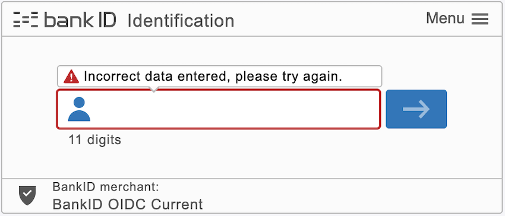
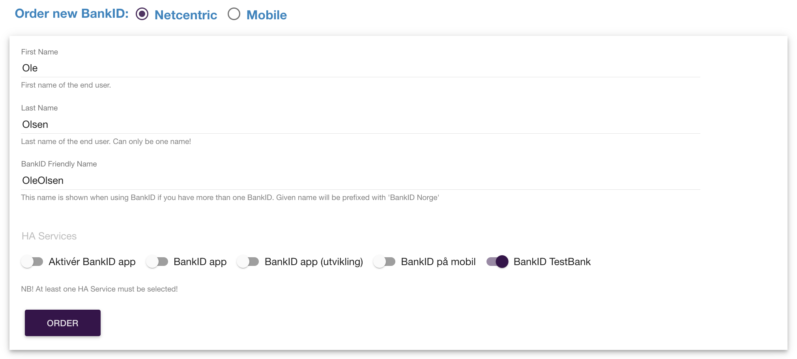
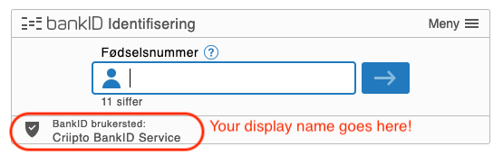

import ConsentRevocation from '../../../components/ConsentRevocation';
import NorwegianBankIdJwtSnippet from '../../../snippets/jwt-payloads/norwegian-bankid';
import NorwegianBankIdBiometricJwtSnippet from '../../../snippets/jwt-payloads/norwegian-bankid-biometric';

## JWT/Token examples

### Kodebrikke authenticators

Triggered with `acr_values=urn:grn:authn:no:bankid:high` (or `acr_values=urn:grn:authn:no:bankid`)

<Highlight icon="info">

The level of assurance for these authenticators are: High

</Highlight>

<NorwegianBankIdJwtSnippet />

The `uniqueUserId` identifies the legal person corresponding to the login, and is not considered sensitive.

### Biometric authenticator (BankID app)

Triggered with `acr_values=urn:grn:authn:no:bankid:substantial`

<Highlight icon="info">

The level of assurance for this authenticator is: Substantial

Note that there is no `certsubject` returned when using Biometrics.

</Highlight>

<NorwegianBankIdBiometricJwtSnippet />

## Test users

### Creating netcentric test users

Test users are created through the web page at [https://ra-preprod.bankidnorge.no/#/search/endUser](https://ra-preprod.bankidnorge.no/#/search/endUser).

1. Go to the ["TEST NUMBER GENERATOR"](https://ra-preprod.bankidnorge.no/#/generate) to generate a random, valid SSN.  
   _If you want to test [BankID Biometric](/verify/e-ids/norwegian-bankid/#testing-bankid-biometric), please make sure that the "Synthetic" checkbox is unchecked before generating a new number. BankID Biometric app does not currently support synthetic SSN numbers, so you won't be able to use them for testing._
2. It now says "Could not find any bankIDs for ...".
3. Fill out the first name, last name, and BankID friendly name.
4. Ensure that `BankID app` is enabled in the "HA services" section, if you want to use BankID Biometric.
5. Click "Order" to initiate the process.
6. Click the pencil icon and add a phone number and an email that you want to associate with the test user.
   _You can use any values that match the correct email and phone number formats (note that the number of digits will differ per country). Random values are acceptable as you'll be able to access the one-time codes via URLs, as shown in steps 5 and 11 of the [Testing BankID Biometric section](/verify/e-ids/norwegian-bankid/#testing-bankid-biometric)._
7. Once the process is complete, you will have a test user. User name is the generated SSN, one time password (OTP) is always "otp", and password is always "qwer1234".

<Highlight icon="info">

It can take up to 1 hour before a newly created test user is activated.

</Highlight>

You can test it out at [our authentication demo site](https://verify-login.azurewebsites.net), which is a small sample hosted by Idura.

### Renewing netcentric test users

If you run into issues with test users created earlier (e.g. errors when entering the one time password), your test user certificate might have expired.



This can be fixed by ordering a new netcentric BankID:

- Find your test user by entering its Personal ID Number number at [https://ra-preprod.bankidnorge.no/#/search/endUser](https://ra-preprod.bankidnorge.no/#/search/endUser)
- Fill in the form to order the new netcentric BankID, choosing BankID TestBank in HA Services, and click "Order"



### Testing BankID Biometric

Start by creating a netcentric test user as described [above](/verify/e-ids/norwegian-bankid/#creating-netcentric-test-users).

You will then need to install the test version of the BankID App. Contact our [support team](mailto:orders@idura.eu) to get access to the `iOS` (distributed via `TestFlight`) or `Android` version of the test app. In your request, please provide the email address linked to your Apple ID (for `iOS`) or your Google account for the Play Store (for `Android`) used for testing. Our team will get back to you with confirmation and download links for the test app.

The app must be activated before first use:

1. Press the **Activate BankID app** button
2. Press the **Activate** button
3. Enter the birth number (SSN) for the test user you created and press the **Next** button
4. Enter the phone number you associated to the test user and press the **Next** button
5. Open the following page to get your your SMS one-time code (after replacing the `yourTestSsn` placeholder with your actual test-SSN): https://toba-preprod.bankidapis.no/test-events/sms-sent-to-qualified-user/yourTestSsn  
   _Note: The page might need to be refreshed several times, and if multiple activations are done in a short period, old SMS codes may be shown. Only the newest activation code will at any point be valid_
6. Type the one-time code that is shown on the website into the app and press the **Next** button
7. Select **Alternative activation** in the next page
8. Press the **Get activation codes** button
9. Proceed past the information pages that explain **What you need** and the **Steps to activate** with the chosen method
10. Press the **Send email** button in the "Is this your email?” screen
11. Open the following page to get your email activation codes (once again, replace the yourTestSsn placeholder with your test-SSN) https://ra-preprod.bankidnorge.no/notification-console/content/yourTestSsn
12. Type the code words that are shown on the website into the app and press the **Next** button
13. Press the **Next** button in the "Log in using BankID to complete the activation” screen
14. Wait until BankID client has loaded in the browser. Pick **BankID app** in the method list if it is not already preselected.
15. Type "qwer1234” as personal password and click the blue arrow button to the right
16. A progress bar will appear and when finished you will be activated
17. Enable biometrics (which will take you through a flow where you must agree to the terms and conditions)
18. Run your first biometrics-based login

## Data and consent for Norwegian BankID

### Available data / scopes

Basic user information, full name, and date of birth are always made available. Additional data may be requested and is released with explicit user consent only.

For applications configured to use a `dynamic` `scope` strategy, the following `scope` tokens can be supplied: `ssn`.

<table>
  <thead>
    <tr>
      <th>**Data type**</th>
      <th>**Released**</th>
      <th>**Verified**</th>
      <th>**scope**</th>
      <th>**login_hint**</th>
    </tr>
  </thead>
  <tbody>
    <tr>
      <td>Full name</td>
      <td>Always</td>
      <td>Yes</td>
      <td></td>
      <td></td>
    </tr>
    <tr>
      <td>Date of birth</td>
      <td>Always</td>
      <td>Yes</td>
      <td></td>
      <td></td>
    </tr>
    <tr>
      <td>SSN ("fødselsnummer" in Norwegian)</td>
      <td>User consent</td>
      <td>Yes</td>
      <td>`ssn`</td>
      <td>`scope:ssn`</td>
    </tr>
  </tbody>
</table>

#### Example (partial) authorize request with scopes

```text
https://YOUR_SUBDOMAIN.idura.broker/oauth2/authorize?scope=openid ssn&...
```

Alternatively, you can send them in the `login_hint`

```text
https://YOUR_SUBDOMAIN.idura.broker/oauth2/authorize?...&login_hint=scope:ssn&...
```

which can be a useful if you are working with technology that does not let you control the `scope` value.

Access to the SSN is governed by Norwegian law, as described in the [Ordering Norwegian BankID](/eid-specifics/order-no-bankid) guide.

The unverified data are supplied by end-users and not verified by Bidbax (operator of BankID) or the Norwegian banks.

### Consent model

End-users must explicitly grant consent to releasing the data to you.

The consent model is enforced by Bidbax, and they also provide the consent and data collection dialogs.

If you choose the consent model **Already granted**, you are responsible for obtaining consent from your end-users before they go through the login flow.

### Forced and optional consent

If you request SSN, it will be treated as a required value. End users will not be allowed to complete a login until they have explicitly given their consent to release SSN.

All other additional data are treated as optional values. A login may complete even if the user does not consent to release the requested data.

Consent to SSN will be stored by Idura for 1 year for your tenant, after which the user must provide explicit SSN consent again.

<Highlight icon="info">

Idura _does not_ store the SSN itself, just the fact that the user has granted your tenant access to it.

</Highlight>

<ConsentRevocation />

### Configuration

You can use the [Idura Dashboard](https://dashboard.criipto.com/providers/NO_BANKID) to configure access to the optional user data, in the **Identity Sources** -> **NO BankID** section.

## Signing text

Norwegian BankID supports signing text.

Text signing is triggered by using the `action` and `message` parameters [via login_hint](https://docs.criipto.com/verify/getting-started/oidc-intro/#the-loginhint-parameter).

- The `action` parameter must be set to `sign`
- The `message` parameter must be base64 encoded.

_Note: Signing produces very large JWTs that are not appropriate for authentication/Bearer header use_

Text signing has a different eID cost than authentication, please [contact Idura sales](https://www.criipto.com/contact) if you have questions.

<details>
  <summary><strong>Example</strong></summary>

`login_hint=action:sign message:VmVuZG9yOgoKQ29vbCBEZWxpdmVyeQoKQW1vdW50OgoKMzAwIEVVUgoKCgpJIGFwcHJvdmUgdGhpcyB0cmFuc2FjdGlvbi4=`

Try out the example in [our URL builder](/verify/guides/authorize-url-builder/?acr_values=urn:grn:authn:no:bankid&action=sign&message=Vendor%3A%0A%0ACool%20Delivery%0A%0AAmount%3A%0A%0A300%20EUR%0A%0A%0A%0AI%20approve%20this%20transaction.)

</details>

## BankID Biometrics assurance level

BankID Biometrics assurance level is “Substantial”.

[Learn more about assurance levels](https://ec.europa.eu/digital-building-blocks/wikis/display/DIGITAL/eIDAS+Levels+of+Assurance).

If you can only use assurance level “High” in your login flow, you must explicitly specify the [login_hint=BID](#modifying-user-flows) in your authorize requests to Idura Verify. _Please note that using `login_hint=BID` will disable biometrics in the BankID app._

## Modifying user flows

By default, the user flow is controlled by the user-defined settings of the BankID app: no additional configurations required. If necessary, you can adjust the user flow by adding a `login_hint` to the [authorize URL](/verify/guides/authorize-url-builder/).

The table below provides a list of options for using `login_hint` with Norwegian BankID, and the resulting user flows. Check [our guide on prefilled fields](https://docs.criipto.com/verify/guides/prefilled-fields/) to learn more.

<table>
  <thead>
    <th>Parameter name </th>
    <th>Description</th>
  </thead>
  <tbody>
    <tr>
      <td>`login_hint=BID`</td>
      <td>
        The user will be redirected to the BankID app, with biometrics disabled. The user will be
        queried for userID(i.e. national identity number) in the first dialogue.
      </td>
    </tr>
    <tr>
      <td>`login_hint=BID:[SSN]`, where `[SSN]` has the format `DDMMYYXXXXX` </td>
      <td>
        The user will be redirected to the BankID app (with biometrics disabled) along with a
        pre-selected userID. The userID dialogue is omitted in this case.
      </td>
    </tr>
    <tr>
      <td>`login_hint=BIS`</td>
      <td>
        The user will be redirected to the BankID app. The user will be queried for userID in the
        first dialogue. This option does not disable biometrics.{' '}
      </td>
    </tr>
    <tr>
      <td>`login_hint=BIS:[SSN]`, where `[SSN]` has the format `DDMMYYXXXXX`</td>
      <td>
        The user will be redirected to the BankID app with a pre-selected userID. This option does
        not disable biometrics.
      </td>
    </tr>
    <tr>
      <td>no `login_hint` provided</td>
      <td>
        The default settings of the BankID app on the user's device will determine the flow (whether
        biometrics are enabled or disabled).
      </td>
    </tr>
  </tbody>
</table>

## Ordering Norwegian BankID

To start accepting real users with Norwegian BankID, you must first request your _client credentials_ from Bidbax. The credentials consists of a _client id_ and a _client secret_.

<Highlight icon="file-lines">

**Prerequisites for ordering**

In order to apply for the BankID client credentials for a company you must meet the basic requirements:

- Your company must be a customer of a Norwegian Bank. Most banks in Norway are part of the BankID network.
- The person that will sign the contract must be in possession of one of these personal eIDs: Norwegian BankID, Swedish BankID, or Danish MitID.
- You must have completed step 4 in the [Get ready for production](/verify/guides/production) guide. You will need the production domain to complete the order for your client credentials.

</Highlight>

_The [BankID OIDC Biometrics](#bankid-biometrics-assurance-level) option is **always** included in the basis agreement._

### Ordering the client credentials

To order production credentials please send a request to

<p style={{ textIndent: '50px' }}>
  <a href="mailto:orders@idura.eu?subject=NO BankID for ...">orders@idura.eu</a>
</p>

with answers to these questions:

1. A short description of what your application does and why it needs BankID.
2. Your company: _Name, organisation number, and address_.
3. General contact person at your company for BankID related communication: _Name, mobile phone, and email_.
4. Person registered in the business registry with authorization to sign the agreement: _Name, mobile phone and email_.
5. Your company’s Norwegian bank: _Name, organisation number, and address_.
6. Contact person with authorization to receive the client credentials and client secret: _Name, mobile phone, and email_.
7. Contact person with authorization to block/revoke the use of BankID: _Name, mobile phone, and email_.
8. The display name to appear in the login app. E.g. the name of your company or your specific service (see the image below).
9. The URL of your Idura Verify production domain as setup in step 4 of the [Getting ready for production](/verify/guides/production) guide.
10. If you need access to social security numbers (“fødselsnummer”) please provide a thorough explanation of why and reference the Norwegian law and paragraph that grants you the right to receive them. If SSN is needed, then the reference to the Norwegian Law and Paragraph is mandatory.
11. Finally - if you are not a Norwegian company - you must enclose a company certificate from the official business registry of the country of incoporation.



### Next steps

After Idura has received the above information, we order the client credentials from your bank by filling out an online agreement, which is then sent to the appointed persons at your company for signing. Idura will also sign the agreement.

When all signatures are in place the signed agreement is sent to your bank for further processing and eventual issuance of your client credentials. The whole process typically takes 7-10 business days.

Once you have received credentials, they must be entered into the Idura dashboard to configure your NO BankID integration. This is done under <a href="https://dashboard.criipto.com/providers/NO_BANKID" target="_blank">eID providers > NO BankID</a>.
