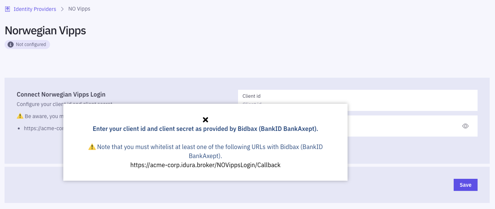

import NorwegianVippsJwtSnippet from '../../../snippets/jwt-payloads/norwegian-vipps'

## JWT/Token example

<NorwegianVippsJwtSnippet />

## Test users

In order to test Vipps Login you need to install the Vipps app in a special test version on your device. Follow the Vipps [guide with instructions](https://developer.vippsmobilepay.com/docs/test-environment/#test-apps) on how to set up test apps.

In order to test you also need a test phone number. Write to [orders@criipto.com](mailto:orders@criipto.com) and put something like "Vipps Login test number" in the subject line.

## Available data / scopes
Username is always made available. 

For applications configured to use a `static` `scope` strategy, address, email, phone and birthdate are always made available.
You can also configure your tenant so it requests SSN as well.

For applications configured to use a `dynamic` `scope` strategy, the following `scope` tokens can be supplied: `address`, `email`, `phone`, `birthdate` and `ssn` (`scope=openid phone email...`).

### Example (partial) authorize request with scopes
```text
https://YOUR_SUBDOMAIN.criipto.id/oauth2/authorize?scope=openid phone ssn&...
```
Alternatively, you can send them in the `login_hint`
```text
https://YOUR_SUBDOMAIN.criipto.id/oauth2/authorize?...&login_hint=scope:phone scope:ssn&...
```
which can be a useful if you are working with technology that does not let you control the `scope` value.

## Ordering Norwegian Vipps Login

To start accepting real users to log in with the Norwegian Vipps app, you must first request a set of secret keys - so-called _client credentials_ from Vipps AS.

<Highlight icon="file-lines">

**Prerequisites for ordering**

In order to apply for the Vipps Login client credentials for a company you must meet the basic requirements:

- Your company must be registered in the central Norwegian business registry, _Brønnøysundregistrene_
- The person that will sign the contract must be in possession of a Norwegian BankID
- You must have completed step 4 in the [Getting ready for production](/verify/guides/production) guide. You will need the production domain when registering with Vipps.

</Highlight>

### Ordering the client credentials

Before you can order the credentials from Vipps you will need to have created a production domain in Criipto Verify as described in the [Getting ready for production guide](/verify/guides/production)). 

Once you have set up the production domain go to the [Identity sources](https://dashboard.criipto.com/providers/NO_VIPPS) section and take note of the URL displayed. It must be supplied when ordering the client credentials.



To order the actual credentials please go to the Vipps order page located at [https://vippsbedrift.no/signup/logginnmedvipps](https://vippsbedrift.no/signup/logginnmedvipps) and fill out the form as described.

Note that the bears some resemblance to the form used to order Vipps for payment so please consider the notes below when filling out the form:
- The filed labelled _"Navn på salgssted slik det vil vises for kunden i Vipps-appen"_ is to be filled out with the name that should appear in the Vipps app when a user logs in
- In the section labelled _"Organisasjonens kontaktinformasjon"_ please enter the name and details of the person that will receive the secret keys. This person will also be granted access to the [Vipps administration portal](https://portal.vipps.no/login)

### Next steps

After you have order the client credentials by filling out the online agreement it is proccessed by Vipps. And if you are approved, the designated contact person will receive the credentials. 

Once you have received the client credentials, they must be entered into the Criipto Verify management UI, as indicated in the above image, to configure your NO Vipps Login integration.

