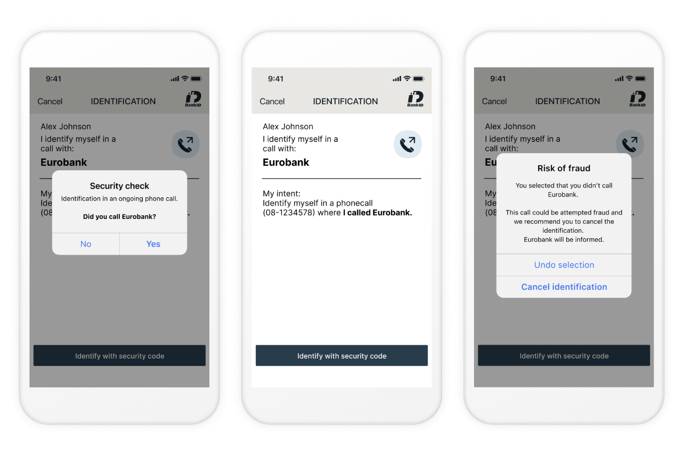
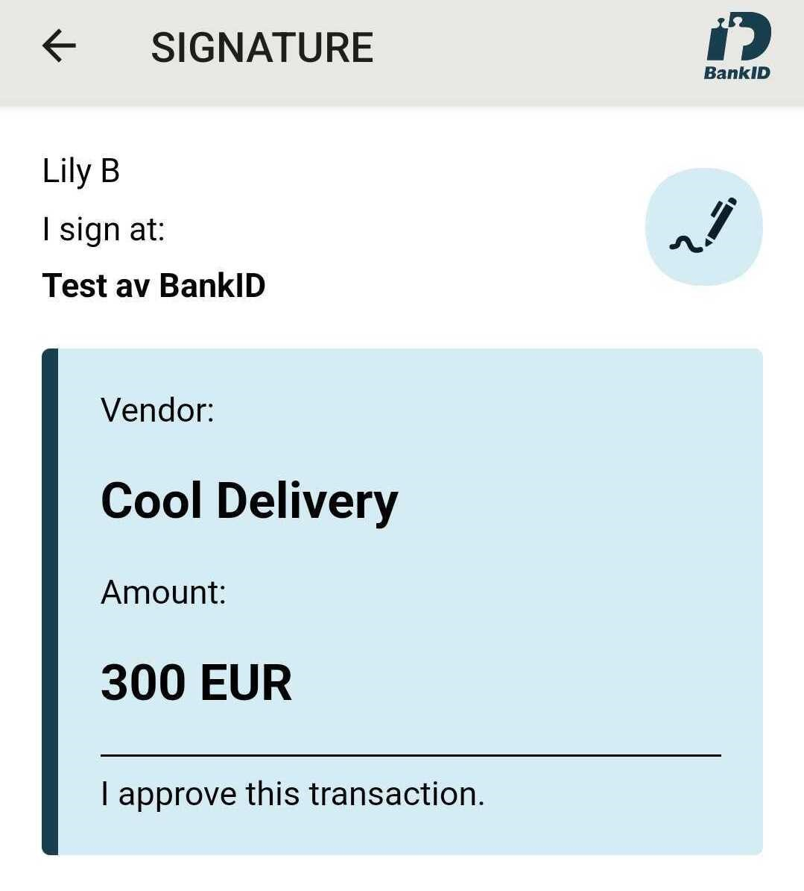

import JwtPayloadViewer from '../../../components/JwtPayloadViewer';
import SwedishBankIdJwtSnippet from '../../../snippets/jwt-payloads/swedish-bankid';

## JWT/Token example

<SwedishBankIdJwtSnippet />

### Optional claims for native BankID signature verification

If your use case requires verifying the signature (which is <a href="https://www.bankid.com/utvecklare/guider/teknisk-integrationsguide/verifiera-signaturer" target="_blank">not required, but possible</a>), you have an option to request the evidence data as returned by the underlying e-ID provider.
This can be done by adding `scope=openid evidence` (or `login_hint=scope:evidence`) to your authorize request.

With this configuration, the issued JWT will contain two additional claims: `evidence` and `ocspResponse`:

<JwtPayloadViewer
  payload={{
    identityscheme: 'sebankid',
    nameidentifier: '1373c272b61a4cb588b29c44883fe62f',
    sub: '{1373c272-b61a-4cb5-88b2-9c44883fe62f}',
    ssn: '196802020575',
    name: 'Terne Paulsen',
    given_name: 'Terne',
    family_name: 'Paulsen',
    ipaddress: '77.241.128.160',
    country: 'SE',
    evidence: 'PD94bWwgdmVyc2lvbj0i...5hdHVyZT4=',
    ocspResponse: 'MIIHdgoBAKCCB28wggdrBgk...uSbCquVT1J',
  }}
/>

_The full content of `evidence` and `ocspResponse` is omitted for brevity._

#### Avoiding excessively large JWT payload

When included in the payload, `evidence` and `ocspResponse` claims will significantly increase the size of the JWT token, potentially causing it to exceed the size limitations of an HTTP header. The bloated JWTs would thus become unusable as Bearer tokens for accessing APIs.

To address this concern, consider changing the <a href="https://openid.net/specs/oauth-v2-multiple-response-types-1_0.html" target="_blank">response type</a> in your [authorization request](/verify/getting-started/oidc-intro/#example-authorization-url) to `response_type=code id_token`.

In this case, a more compact ID Token with only essential claims will be issued from the Token endpoint. The client can subsequently fetch all data about the user from the Userinfo endpoint.

_ With `code id_token` response type, the ID Token from the token endpoint will always be the same (and have nothing but a `sub` that is user-specific). In contrast, when using the `response_type=code`, the full ID Token is returned immediately in exchange for code._

## Test users

Swedish BankID test users are created at the <a href="https://demo.bankid.com/" target="_blank">Demo Bank web site</a>.

For more information on how to configure your device for test and setup test users, see <a href="https://www.bankid.com/en/utvecklare/test/skaffa-testbankid" target="_blank">BankID for test</a>. Follow the steps outlined in the guide:

1. **Download the app/program.**
2. **Configure the client for test.**
3. **Get a BankID for test.** _If you already have a fully-configured production or test BankID, you can use it to create a test user. Otherwise, see below on how to bootstrap the process._

<Highlight icon="info">

<a id="generating-test-user"></a>

**Get a BankID for test (without an existing production/test BankID)**

Log in at the <a href="https://demo.bankid.com/login" target="_blank">Demo bank website</a> with a **Personal code** option. The code will be sent to you by email.

Once logged in, create a test user by selecting **Mobile BankID** or **BankID on file** (for desktop version) option under **Issue BankID for test**. Please note that a test user must be created with a valid Swedish personal identity number ("Personnummer").
You can generate a valid Personnummer using one of the available online tools, such as <a href="https://fejk.se/" target="_blank">this generator</a>. After creating a test user, you will be able to link it to the mobile or desktop version of the test app.

For future test user issuances, you can log in using an already-issued BankID test user by selecting the **Test BankID** option <a href="https://demo.bankid.com/login" target="_blank">during login</a>.

</Highlight>

_Note_ that, as is also described on the website, using test BankID users does require a reconfiguration of the BankID application. This means it cannot be used for real BankID. So if you are Swedish and already have BankID on your phone, you may want to use a spare phone for testing.

## BankID Phone Authentication

<a href="https://www.bankid.com/en/foretag/telephone-identification" target="_blank">
  BankID in telephone calls
</a>
facilitates user authentication during a phone call.

### Overview

The Phone authentication flow is designed for scenarios where a user is talking with your customer service agent over the phone, and you need to verify that the caller is who they say they are.
This is commonly used when a customer contacts their bank or when a call center agent needs to verify the caller's identity.

#### The process looks as follows:

1. SSN Input: The customer service agent enters the user's personal identification number (SSN) in their system, or the user is prompted to input their SSN via an automated PBX system.
2. Authentication request: The customer service agent (if applicable) indicates whether the call was initiated by the user or the company they represent, then initiates authentication request.
3. Security check: The Swedish BankID app displays a phone icon and the company’s name, prompting the user with a Yes/No security check question.
4. User Response: If the user selects Yes, they can proceed by identifying themselves with a security code or biometrics. If the user selects No, they can cancel the identification process.



The example above demonstrates what it looks like when the customer is calling the service. A different security check is shown when the service is calling the customer.

### The underlying CIBA flow

Idura Verify facilitates Swedish BankID phone authentication via the [CIBA flow](/verify/getting-started/oidc-intro/#authenticate-with-ciba).

### Implementing BankID Phone Authentication

The CIBA flow is only available to traditional server-based web applications (confidential clients) and requires client validation for authentication requests. We'll use [private key JWTs](/verify/guides/privatekey-jwt/) for authentication in the example below. An alternative (_less secure_) approach is to use `client_secret` for authentication.

1. Make an `HTTP POST` request to the `/ciba/bc-authorize` endpoint:

```sh
# Replace `$client_assertion` with your JWT assertion
# Replace `YOUR_DOMAIN.idura.broker` with your Idura domain
# Replace `SSN` with a valid Swedish BankID SSN
# Replace `BINDING_MESSAGE` with the text that will be presented to the end user
# `callInitiator` must be either "RP"("Relying Party", e.g. a customer service agent) or "user", depending on who initiated the call.

HTTP POST https://YOUR_DOMAIN.idura.broker/ciba/bc-authorize
Content-Type: application/x-www-form-urlencoded

scope=openid
&callInitiator=RP
&login_hint=sub:ssn:SSN
&acr_values=urn:grn:authn:se:bankid
&binding_message=BINDING_MESSAGE
&client_assertion_type=urn:ietf:params:oauth:client-assertion-type:jwt-bearer
&client_assertion=$client_assertion
```

2. A successful response will look something like this:

```sh
{
  "auth_req_id" : "3857f8ff-21b9-48ae-a732-a3bd8128a7ae",
  "expires_in" : 120
}
```

3. Poll the token endpoint (`/oauth2/token`) to get a response with an ID token.  
   The `auth_req_id` is used to construct a poll request on the token endpoint:

```sh
# Replace `AUTH_REQ_ID` with the id returned by authentication response
# Replace `$client_assertion` with your JWT assertion

HTTP POST https://YOUR_DOMAIN.idura.broker/oauth2/token
Content-Type: application/x-www-form-urlencoded

auth_req_id=AUTH_REQ_ID
&grant_type=urn:openid:params:grant-type:ciba
&client_assertion_type=urn:ietf:params:oauth:client-assertion-type:jwt-bearer
&client_assertion=$client_assertion
```

_**Polling Frequency:** Bear in mind, that the authentication process requires interacting multiple times with the end-user, so the identification process could take some time. Consequently, the token endpoint should be polled every 5 seconds._

_**Token Delivery Modes:** CIBA allows three token delivery methods: Poll, Ping and Push. Idura Verify only supports the Poll mode at the moment._

4. The result of a poll request will depend on the state of the process:

On successful user identification, a successful token response is returned, e.g.:

```sh
{
  token_type: 'Bearer',
  expires_in: '120',
  id_token: 'eyJ0eXAiOiJKV1QiLCJhbGciOiJSUzI1NiIsImtpZCI6IjgyN0Q5QTNFOTg2MTY0OTVBQzZGRTE3MUFFNkRBM0IzQ0ExNDE5MjEifQ.eyJpc3MiOiJodHRwczovL25hdGFsaWEtZGV2LXRlc3QuY3JpaXB0by5pbyIsImF1ZCI6InVybjpjaWJhIiwiaWRlbnRpdHlzY2hlbWUiOiJzZWJhbmtpZCIsImF1dGhlbnRpY2F0aW9udHlwZSI6InVybjpncm46YXV0aG46c2U6YmFua2lkIiwiYXV0aGVudGljYXRpb25tZXRob2QiOiJ1cm46b2FzaXM6bmFtZXM6dGM6U0FNTDoyLjA6YWM6Y2xhc3NlczpTb2Z0d2FyZVBLSSIsImF1dGhlbnRpY2F0aW9uaW5zdGFudCI6IjIwMjQtMDUtMjJUMTA6NDE6NDEuMzYxWiIsIm5hbWVpZGVudGlmaWVyIjoiYmI5YzIzNjRkZmFlNDRmM2JjZmQ5OTkwNTNkOTRmOWUiLCJzdWIiOiJ7YmI5YzIzNjQtZGZhZS00NGYzLWJjZmQtOTk5MDUzZDk0ZjllfSIsInNlc3Npb25pbmRleCI6ImI2NWYxMWI2LWViYTctNDg4Mi05MDBhLTVmMmQ5M2EzOGRiYSIsInNzbiI6IjE5NjgwMjAyMDU3NSIsIm5hbWUiOiJUZXJuZSBQYXVsc2VuIiwiZ2l2ZW5uYW1lIjoiVGVybmUiLCJnaXZlbl9uYW1lIjoiVGVybmUiLCJzdXJuYW1lIjoiUGF1bHNlbiIsImZhbWlseV9uYW1lIjoiUGF1bHNlbiIsImlwYWRkcmVzcyI6IjE4NS4xNTcuMTM0LjEzNCIsImNvdW50cnkiOiJTRSIsImlhdCI6MTcxNjM3NDUwMSwibmJmIjoxNzE2Mzc0NTAxLCJleHAiOjE3MTYzNzU3MDF9.RVQnlukfoH597uXzE1Gays5DElGzAr8xgOmi7ZWppaL3QPGhV4vK2o6qLhxXg_-FKG9xCwHR6gEhnNzWA3W3B6Q2zJeQTYh9okUvTmmhAFIyDL7lEtfWVVKUKvauDisYVZDjAxJQS_1zbgPEi5I-UJ6_kvMGH-wC13MAD2bZGTGR2dR-ZevBUn7plOt0PKXrIZD3vwxDfebTMPQqX_9SNT5F7GLjCcpeVK-T5LOgmUMFcTAbHvNyklqP5ymRHsZLDw_ib4I7ZqODhR-3uISWo1NvG4Y84iBcqv50WRNlmMUm004LfPw1flM5DNsVyUWCqYW8m7eBEwLp5va-6OQG4w',
  access_token: 'cf1ce646-7fbe-4740-9c56-fe3f0891f6c6'
}
```

The user has not yet interacted with the Swedish BankID app:

```sh
HTTP/1.1 400 Bad Request
{
  "error": "authorization_pending",
  "error_description": "awaiting first user interaction"
}
```

The user has been presented with a message requesting to confirm if they can acknowledge that a request for identification is warranted:

```sh
HTTP/1.1 400 Bad Request
{
  "error": "authorization_pending",
  "error_description": "awaiting user request acknowledgement"
}
```

The user has acknowledged the request, but has not yet identified themselves:

```sh
HTTP/1.1 400 Bad Request
{
  "error": "authorization_pending",
  "error_description": "awaiting user identification"
}
```

The user did not acknowledge that the identification request warranted or canceled the request before identification was performed:

```sh
HTTP/1.1 400 Bad Request
{
  "error": "access_denied",
  "error_description": "user declined"
}
```

## BankID Headless Authentication

### Overview

Headless authentication is designed for flows where you want maximum control over how user interacts with same device and QR flows for BankID.

For instance you could render the QR flow in your own website, or trigger app2app in your native app without having to open a browser

### The underlying Headless flow

Idura Verify facilitates Swedish BankID headless authentication via the [Headless flow](/verify/getting-started/oidc-intro/#authenticate-headless).

### Implementing BankID Headless Authentication

The Headless flow is only available to traditional server-based web applications (confidential clients) and requires client validation for authentication requests. We'll use [private key JWTs](/verify/guides/privatekey-jwt/) for authentication in the example below. An alternative (_less secure_) approach is to use `client_secret` for authentication.

1. `HTTP POST` request to the `/headless/authorize` endpoint:

```sh
# Replace `$client_assertion` with your JWT assertion
# Replace `YOUR_DOMAIN.idura.broker` with your Idura domain

HTTP POST https://YOUR_DOMAIN.idura.broker/headless/authorize
Content-Type: application/x-www-form-urlencoded

scope=openid
&end_user_ip=127.0.0.1
&acr_values=urn:grn:authn:se:bankid
&client_assertion_type=urn:ietf:params:oauth:client-assertion-type:jwt-bearer
&client_assertion=$client_assertion
```

2. A successful response will look something like this:

```sh
{
  "headless_req_id" : "3857f8ff-21b9-48ae-a732-a3bd8128a7ae",
  "expires_in" : 120,
  "acr_data": {
    "qrData": "bankid.5367b735-a3f9-47d9-aafc-6d2ad5a14901.0.425c66c472e756fc6a070b86eef1adb4fac0a2714d828c902afa77a5b15e8590",
    "autoStartToken": "d2c96ea2-f8d9-4e9f-8d39-4f2e88e10e1c"
  }
}
```

3. Poll the token endpoint (`/oauth2/token`) to get a response with an ID token.  
   The `headless_req_id` is used to construct a poll request on the token endpoint:

```sh
# Replace `HEADLESS_REQ_ID` with the id returned by authentication response
# Replace `$client_assertion` with your JWT assertion

HTTP POST https://YOUR_DOMAIN.idura.broker/oauth2/token
Content-Type: application/x-www-form-urlencoded

headless_req_id=HEADLESS_REQ_ID
&grant_type=urn:urn:params:grant-type:headless
&client_assertion_type=urn:ietf:params:oauth:client-assertion-type:jwt-bearer
&client_assertion=$client_assertion
```

_**Polling Frequency:** Bear in mind, that the authentication process requires interacting multiple times with the end-user, so the identification process could take some time. Consequently, the token endpoint should be polled every 5 seconds._

4. The result of a poll request will depend on the state of the process:

On successful user identification, a successful token response is returned, e.g.:

```sh
{
  token_type: 'Bearer',
  expires_in: '120',
  id_token: 'eyJ0eXAiOiJKV1QiLCJhbGciOiJSUzI1NiIsImtpZCI6IjgyN0Q5QTNFOTg2MTY0OTVBQzZGRTE3MUFFNkRBM0IzQ0ExNDE5MjEifQ.eyJpc3MiOiJodHRwczovL25hdGFsaWEtZGV2LXRlc3QuY3JpaXB0by5pbyIsImF1ZCI6InVybjpjaWJhIiwiaWRlbnRpdHlzY2hlbWUiOiJzZWJhbmtpZCIsImF1dGhlbnRpY2F0aW9udHlwZSI6InVybjpncm46YXV0aG46c2U6YmFua2lkIiwiYXV0aGVudGljYXRpb25tZXRob2QiOiJ1cm46b2FzaXM6bmFtZXM6dGM6U0FNTDoyLjA6YWM6Y2xhc3NlczpTb2Z0d2FyZVBLSSIsImF1dGhlbnRpY2F0aW9uaW5zdGFudCI6IjIwMjQtMDUtMjJUMTA6NDE6NDEuMzYxWiIsIm5hbWVpZGVudGlmaWVyIjoiYmI5YzIzNjRkZmFlNDRmM2JjZmQ5OTkwNTNkOTRmOWUiLCJzdWIiOiJ7YmI5YzIzNjQtZGZhZS00NGYzLWJjZmQtOTk5MDUzZDk0ZjllfSIsInNlc3Npb25pbmRleCI6ImI2NWYxMWI2LWViYTctNDg4Mi05MDBhLTVmMmQ5M2EzOGRiYSIsInNzbiI6IjE5NjgwMjAyMDU3NSIsIm5hbWUiOiJUZXJuZSBQYXVsc2VuIiwiZ2l2ZW5uYW1lIjoiVGVybmUiLCJnaXZlbl9uYW1lIjoiVGVybmUiLCJzdXJuYW1lIjoiUGF1bHNlbiIsImZhbWlseV9uYW1lIjoiUGF1bHNlbiIsImlwYWRkcmVzcyI6IjE4NS4xNTcuMTM0LjEzNCIsImNvdW50cnkiOiJTRSIsImlhdCI6MTcxNjM3NDUwMSwibmJmIjoxNzE2Mzc0NTAxLCJleHAiOjE3MTYzNzU3MDF9.RVQnlukfoH597uXzE1Gays5DElGzAr8xgOmi7ZWppaL3QPGhV4vK2o6qLhxXg_-FKG9xCwHR6gEhnNzWA3W3B6Q2zJeQTYh9okUvTmmhAFIyDL7lEtfWVVKUKvauDisYVZDjAxJQS_1zbgPEi5I-UJ6_kvMGH-wC13MAD2bZGTGR2dR-ZevBUn7plOt0PKXrIZD3vwxDfebTMPQqX_9SNT5F7GLjCcpeVK-T5LOgmUMFcTAbHvNyklqP5ymRHsZLDw_ib4I7ZqODhR-3uISWo1NvG4Y84iBcqv50WRNlmMUm004LfPw1flM5DNsVyUWCqYW8m7eBEwLp5va-6OQG4w',
  access_token: 'cf1ce646-7fbe-4740-9c56-fe3f0891f6c6'
}
```

The user has not yet completed the authentication, `acr_data.hintCode` provides details as to how far they are in the process.:

```sh
HTTP/1.1 400 Bad Request
{
  "error": "authorization_pending",
  "error_description": "awaiting first user interaction",
  "acr_data": {
    "qrData": "bankid.5367b735-a3f9-47d9-aafc-6d2ad5a14901.0.425c66c472e756fc6a070b86eef1adb4fac0a2714d828c902afa77a5b15e8590",
    "hintCode": "...."
  }
}
```

The user did not acknowledge that the identification request warranted or canceled the request before identification was performed:

```sh
HTTP/1.1 400 Bad Request
{
  "error": "access_denied",
  "error_description": "user declined"
}
```

## Signing text/markdown

Swedish BankID supports signing text and markdown.

Text signing is triggered by using the `action` and `message` parameters [via login_hint](https://docs.criipto.com/verify/getting-started/oidc-intro/#the-loginhint-parameter).

- The `action` parameter must be set to `sign`
- The `message` parameter must be base64 encoded and at most 40,000 characters after base64 encoding.
- The `message` parameter supports markdown text.

_Note: Signing produces very large JWTs that are not appropriate for authentication/Bearer header use_

Text signing has a different eID cost than authentication. If you have questions, please [contact sales](https://www.criipto.com/contact).

<details>
  <summary><strong>Example</strong></summary>

`login_hint=action:sign message:VmVuZG9yOgoKIyMgQ29vbCBEZWxpdmVyeQoKQW1vdW50OgoKIyMgMzAwIEVVUgoKLS0tCgpJIGFwcHJvdmUgdGhpcyB0cmFuc2FjdGlvbi4=`

Try out the example in [our URL builder](/verify/guides/authorize-url-builder/?acr_values=urn:grn:authn:se:bankid&action=sign&message=Vendor%3A%0A%0A%23%23%20Cool%20Delivery%0A%0AAmount%3A%0A%0A%23%23%20300%20EUR%0A%0A---%0A%0AI%20approve%20this%20transaction.)



</details>

## Round-tripping data that is not visible to the end user

Swedish BankID allows you to send data along in both authentication and signature flows,
which they will then embed in the `evidence` claim after a flow completes succesfully.

You can supply this value via a `nonVisibleData` parameter in the `login_hint`.
The supplied value _must be_ base64 encoded.
Idura does not attempt to parse or validate the value, we only pass on what is given to the native provider API.

<details>
  <summary><strong>Example</strong></summary>

`login_hint=nonVisibleData:bm90IHZpc2libGUgdG8gZW5kIHVzZXJzLCBhY2Nlc3NpYmxlIGluIHRoZSBgZXZpZGVuY2VgIGNsYWltIGFmdGVyIGEgZmxvdyBjb21wbGV0ZXMgc3VjY2VzZnVsbHk=`

Try out the example in [our URL builder](/verify/guides/authorize-url-builder/?acr_values=urn:grn:authn:se:bankid&nonVisibleData=Not%20visible%20to%20end%20user)

</details>

## Ordering Swedish BankID

To start accepting real users with Swedish BankID, you must first request a certificate to identify your organization.

Idura acts as a reseller for Swedbank, which means that you will have to go through a simple approval process with Swedbank. The process is managed by Idura.

import template from './files/swedbank-verksamhetsinfo-bankid-template.pdf';

To order the actual certificate, simply <a href={template} download>download this form</a> and return a filled-out copy to <a href="mailto:orders@idura.eu?subject=Swedish BankID for ...&body=Tenant link:" >orders@idura.eu</a> along with your <a href="https://dashboard.criipto.com/support/" target="_blank">tenant support link</a>.

### Next steps

After Idura has received the filled out form, we send it to Swedbank where it will be reviewed and approved. The whole process typically takes up to 10 business days.

Once your organization and your intended use of BankID has been approved, we will create and install the actual certificate in your Idura tenant. You will then be ready to proceed with the steps outlined in the [Getting ready for production guide](/verify/guides/production).
