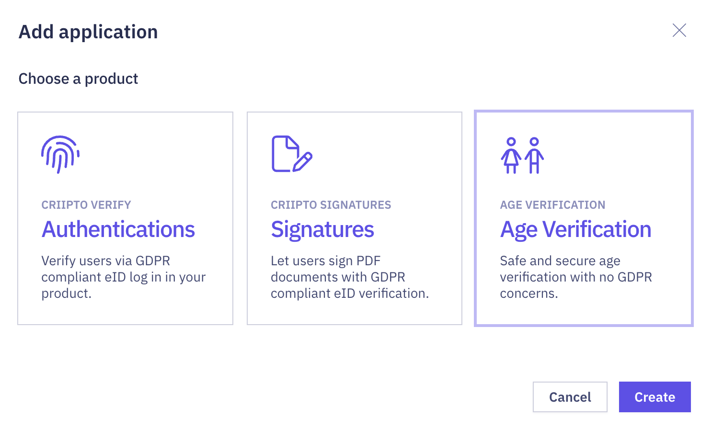
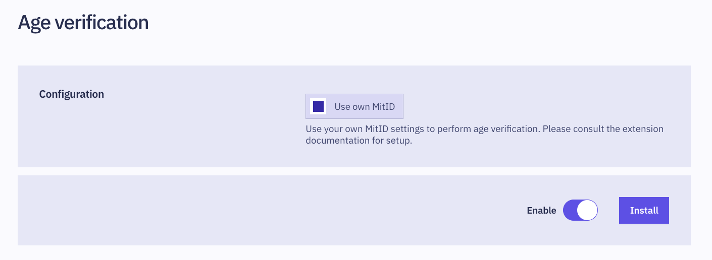

import Layout from '../../../layouts/mdx';

export default Layout;

With the Age Verification extension, you can verify user ages without collecting personal data.
The authentication result will simply confirm if the user meets the age requirement, without including sensitive information such as their full name or birthdate.

<Highlight icon="info">

Age Verification does not require you to set up your own eID provider, as it defaults to using shared Criipto-provided eID providers. This batteries included approach comes with certain limitations, such as the absence of many tenant-specific features.

For instance, the [Custom styling feature](https://docs.criipto.com/verify/guides/custom-styling/) is not available out of the box for Age Verification applications. To enable it, you can switch to using [your own MitID provider](https://docs.criipto.com/verify/guides/age-verification/#optional-use-your-own-mitid-service-provider).

</Highlight>

## Prerequisites

You'll need a [Criipto tenant](https://docs.criipto.com/verify/getting-started/basics/#tenants) and [domain](https://dashboard.criipto.com/domains) to get started.

## Create Age Verification application

1. On your dashboard, navigate to the [**Applications**](https://dashboard.criipto.com/applications) tab and click **Add application**.
2. When prompted to choose a product, select **Age Verification**, then click **Create**.

3. Fill in the details to create your application, then click **Create application**.
4. You're all set: the Age Verification feature will be automatically enabled after creating the application.

<Highlight icon="info">

_If the Age Verification application type is not available, or you're running into any issues during application creation, please contact us via [Slack](https://tiny.cc/criipto-slack) or by [email](mailto:support@criipto.com)._

</Highlight>

## Implementation

### Triggering Age Verification

Age verification is triggered via a [standard OpenID Connect integration](/verify/getting-started/oidc-intro/) using the following settings:

- `acr_values=urn:age-verification`
- `login_hint=country:{country}`, `{country}` can be one of `DK`|`SE`|`NO`|`FI`. _This determines the [eID provider](/verify/e-ids/) for user authentication_.
- `scope=openid is_over_18`; Other supported values are: `is_over_15`, `is_over_16`, `is_over_21`.

### Example JWT

The resulting JWT will indicate whether the user meets the age requirement. Personal data, such as the user's full name and birthdate, is not included.

import JwtSnippet from '../../../snippets/jwt-payloads/age-verification';

<JwtSnippet />

<Highlight icon="info">

The `sub` field is random for each login and cannot be used to correlate the user.

</Highlight>

## Authorize URL Builder

import AuthorizeURLBuilder from '../../../components/AuthorizeURLBuilder';

<AuthorizeURLBuilder
  acr_values={["urn:age-verification"]}
  login_hint="country:DK"
  scope={['openid', 'is_over_18']}
  quirks={false}
/>

## Optional: use your own MitID service provider

If you prefer to use your own MitID service provider instead of the one provided by Criipto, you have the option to do so.  
[During installation](/verify/guides/age-verification/#installation), flip the **Use own MitID** setting to enabled, and then ensure that your Criipto application has allowed `https://{YOUR_CRIIPTO_DOMAIN}/extensions/ext_ageverification/api/callback` as a callback URL.
