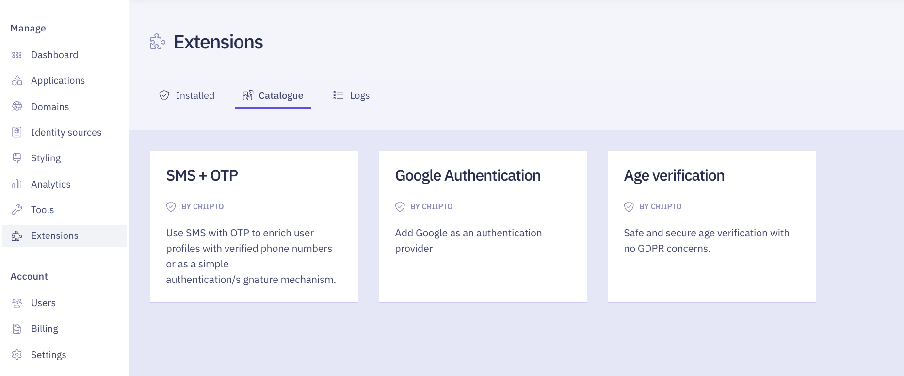

import Layout from '../../../layouts/mdx';

export default Layout;

With the Age Verification extension, you can verify user ages without collecting personal data.
The authentication result will simply confirm if the user meets the age requirement, without including sensitive information such as their full name or birthdate.

## Prerequisites

You'll need a [Criipto tenant](https://docs.criipto.com/verify/getting-started/basics/#tenants), [domain](https://dashboard.criipto.com/domains) and [application](https://dashboard.criipto.com/applications) to get started. When ready, please contact us via [Slack](https://tiny.cc/criipto-slack) or [email](mailto:support@criipto.com), and we'll enable the Extensions feature for your tenant.

## Installation

You can install the Age Verification Extension from your [Criipto Dashboard](https://dashboard.criipto.com) by following these steps:

1. Click on the **Extensions** tab
2. Navigate to the **Catalogue** section
3. Select the **Age Verification** extension to open it
4. Proceed by clicking **Install**

<Highlight icon="info">

_If you encounter an error during installation, ensure that your user account has been granted the necessary permissions to work with extensions._

</Highlight>

## Implementation

### Triggering Age Verification

Age verification is triggered via a [standard OpenID Connect integration](/verify/getting-started/oidc-intro/) using the following settings:

- `acr_values=urn:age-verification`
- `login_hint=country:{country}`, `{country}` can be one of `DK`|`SE`|`NO`|`FI`. _This determines the [eID provider](/verify/e-ids/) for user authentication_.
- `scope=openid is_over_18`; Other supported values are: `is_over_15`, `is_over_16`, `is_over_21`.

### Example JWT

The resulting JWT will indicate whether the user meets the age requirement. Personal data, such as the user's full name and birthdate, is not included.

import JwtSnippet from '../../../snippets/jwt-payloads/age-verification';

<JwtSnippet />

<Highlight icon="info">

The `sub` field is random for each login and cannot be used to correlate the user.

</Highlight>

## Authorize URL Builder

import AuthorizeURLBuilder from '../../../components/AuthorizeURLBuilder';

<AuthorizeURLBuilder
  acr_values={["urn:age-verification"]}
  login_hint="country:DK"
  scope={['openid', 'is_over_18']}
  quirks={false}
/>

<Highlight icon="file-lines">

**OPTIONAL: use your own MitID service provider**  
If you prefer to use your own MitID service provider instead of the one provided by Criipto, you have the option to do so.  
[During installation](/verify/guides/age-verification/#installation), flip the **Use own MitID** setting to enabled, and then ensure that your Criipto application has allowed `https://{YOUR_CRIIPTO_DOMAIN}/extensions/ext_ageverification/api/callback` as a callback URL.

</Highlight>