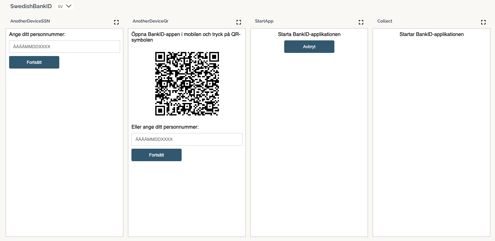
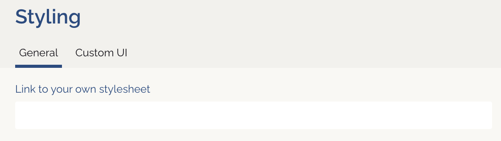
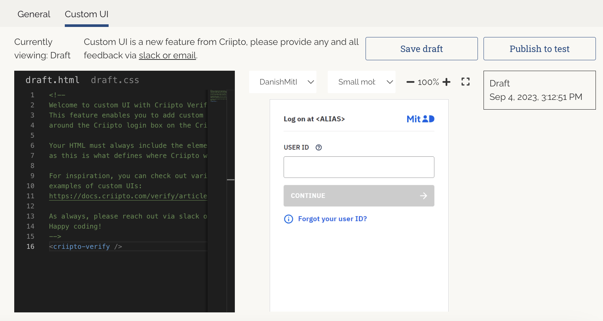
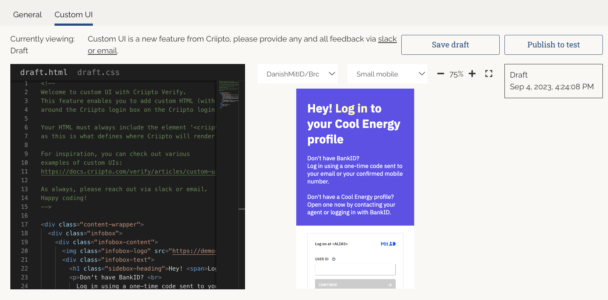

import previews from './images/preview-sebankid.png';
import customStyling from './images/custom-styling.png';

Some of the eID methods require additional dialogs outside of those of the actual eID service.
These may be styled and enhanced to your liking using one of the following approaches: 

1. [Adding your own stylesheet](#custom-css): if your goal is to apply basic styling, including a custom CSS file is all you need. 
2. [Adding custom HTML and CSS](#custom-html): can be used for creating more complex UIs (e.g. a layout with extra information around the Criipto login box).

<Highlight icon="info">

**Note:** To use custom styling with [Age Verification applications](/verify/guides/age-verification/), you need to configure your own MitID provider. 

</Highlight>

## Content Security Policy considerations

Strict **Content-Security-Policy** rules apply to all kinds of custom styling of Criipto Verify dialogs.
This means that if you are referencing any resources via URLs, you must explicitly add the corresponding authorities in the `Style origins` list found in the `General` tab.

<Highlight icon="warning">

**Note** that the live previews you can see in the browser _DO NOT_ enforce a `Content-Security-Policy` - this is only present in the actual login flow.
You can always use the built-in `Try` feature for the various e-ID methods to run an actual login flow in the browser, where `Content-Security-Policy` rules will apply.
You can use your browser's developer tools (Console tab) for troubleshooting.

</Highlight>

## Custom CSS (adding a stylesheet)

You can add your own stylesheet from the `Styling` -> `General` tab of your management dashboard on [dashboard.criipto.com](https://dashboard.criipto.com/styling).

### Preview of the user-facing dialogs

In the `General` tab, you can see a preview of the user-facing dialogs  - such as the ones for SE BankID:



Each eID method supports a specific set of languages - see [UI Language](/verify/guides/choose-language) for details. You can change the language used to generate the previews in the dropdown.

Each of the previews is shown in mobile device size by default, but you can expand each of the previews to desktop size by clicking on the dashed square shown just above each preview. In desktop mode, all dialogs will have a customizable common header and footer structure, as well as the elements presented for mobile devices.

You can enter a URL to your own (self-hosted) style sheet just above the previews, and experiment with the effect of changing the preview tile size. The previews use the value in the `Link to your own style sheet` field, so you can see the effect of your customizations before you hit `Save`.



### 'Dynamic' style sheets

In some cases, bundling all of your CSS in just one style sheet can be tricky and/or infeasible. Criipto Verify supports overriding the _path_ part of the style sheet URL on a per-authorize request basis.

You can specify a `css_path:/a/b/...?c=d&e=f&...` token in the `login_hint` query parameter in your authorize request, which will then override the path and query parts of the pre-configured style sheet URL.
Criipto Verify will use the authority part of your pre-configured URL as a "base" URL, and then set the value you specify in the `css_path` token as the path name and query part of the style sheet URL.

<Highlight icon="file-lines">

If you have not configured a custom style sheet URL, Criipto Verify ignores the `css_path` token in the `login_hint` query parameter.

</Highlight>

#### Example

If you have configured, say,
```
https://my.css.host/static/path
```
as a custom style sheet, and you construct an authorize request containing a
```
css_path:dynamic/subpath?q=x
```
in the `login_hint` parameter, the resulting CSS URL put in the HTML responses from Criipto Verify will change to
```
https://my.css.host/dynamic/subpath?q=x
```

<Highlight icon="file-lines">

You can specify more than 1 query parameter in the `css_path` token. In this case, you must URL-component encode (at least) the `&` characters in the query before adding them to the value of the `css_path` token. The URL-component version of the `&` character is `%26`.

</Highlight>

### Common HTML structures found in user-facing dialogs

### Localizable texts
These appear in both common and dialog-specific HTML elements. The structure is the same everywhere:
```html
    <span class="lang lang-sv">
        <span class="text">...svenska ord...</span>
    </span>
    <span class="lang lang-en">
        <span class="text">...english words...</span>
    </span>
```
The wording can be changed via CSS selectors in your custom style sheet - see examples below.
Depending on the eID, the `lang-sv` class will be replaced with `lang-da`, `lang-nb`, etc.

### Desktop screen sizes

#### Above the Criipto Verify frame
```html
<header id="header" class="default-hidden desktop-show">
    <div class="inner"></div>
</header>
<h1 id="headline" class="default-hidden desktop-show centered">
    <span class="lang lang-sv">
        <span class="text">...svenska ord...</span>
    </span>
    <span class="lang lang-en">
        <span class="text">...english words...</span>
    </span>
</h1>
```
You can change the texts in the `<h1 id="headline">` element via the following CSS:
```css
#headline .lang span {
  display: none;
}
#headline .lang-sv:after {
  content: "...andra svenska ord...";
}
#headline .lang-en:after {
    content: "...other english words...";
}
```
#### Below the Criipto Verify frame
```html
<aside id="description" class="centered default-hidden desktop-show">
    <p>
        <span class="lang lang-sv">
            <span class="text">...svenska ord #1...</span>
        <span class="lang lang-en">
            <span class="text">...english words #1</span>
        </span>
    </p>
    <p>
        <span class="lang lang-sv">
            <span class="text">...svenska ord #2...</span>
        </span>
        <span class="lang lang-en">
            <span class="text">...english words #2</span>
        </span>
    </p>
    <p class="default-hidden">
        <span class="lang lang-sv">
            <span class="text"></span>
        </span>
        <span class="lang lang-en">
            <span class="text"></span>
        </span>
    </p>
    <p class="default-hidden">
        <span class="lang lang-sv">
            <span class="text"></span>
        </span>
        <span class="lang lang-en">
            <span class="text"></span>
        </span>
    </p>
    <p class="default-hidden">
        <span class="lang lang-sv">
            <span class="text"></span>
        </span>
        <span class="lang lang-en">
            <span class="text"></span>
        </span>
    </p>
</aside>
<footer id="footer" class="default-hidden desktop-show">
    <div class="inner centered"></div>
</footer>
```

***Note*** The text elements in the last 3 paragraphs in the `<aside>` are intentionally left blank by default.

You can change the texts in each of the `<p>` elements via the following CSS:
```css
#description p:nth-child(-n+2) .lang span {
  display: none;
}
#description p:nth-child(1) .lang-sv:after {  
  content: '...andra svenska ord #1...';
}
#description p:nth-child(2) .lang-sv:after {  
  content: '...andra svenska ord #2...';
}
#description p:nth-child(1) .lang-en:after {
  content: '...other english words #1...'
}
#description p:nth-child(2) .lang-en:after {
  content: '...other english words #2...'
}
```
where the first selector hides all the default texts in the `<aside id="description">` element in one go, and the subsequent 4 selectors add language-specific texts per `<p>` element.

If you want to show text in one of the hidden-by-default `<p>` elements, you can do the following (here, the third `<p>` is having an English text added):
```css
#description p:nth-child(3) {
  display: inline;
}
#description p:nth-child(3) .lang-en:after {
  content: '...this is hidden by default...'
}
```
***Note*** The first selector is needed to "undo" the effect of the `default-hidden` class on the third `<p>` element.

### CSS classes
#### Generally available
Each `<body>` element has up to 5 CSS classes attached to it:
1. Indicator of the eID method in use - such as `sebankid`.
2. Indicator that this is a page from Criipto Verify - `broker`. This makes it possible to target our pages specifically, even if you use the same CSS file for different websites.
3. Indicator of the flow in use - authentication (`auth`) or signature (`sign`).
4. Indicator of which DNS name the page is loaded on.
5. (Optional) Your very own CSS class name on a per-application basis. You can set it in the management UI as well.

Putting it all together, for a case where:

- your Verify DNS name is `identity.yourdomain.com` 
- you request `authentication` for `SE BankID`
- you have set a CSS class name value of `app-one` for the app requesting authentication

you will have the following CSS class content on the `body` tag:
```html
    <body class="sebankid broker auth host-identity-yourdomain-com app-one">
```

You can use these dynamically added CSS classes to customize the UI on a per-application basis, which may be quite practical for, say, Single Sign-On scenarios where you reuse a Criipto Verify DNS domain across web applications with very different branding requirements.

#### Dialog specific
Each dialog has its own HTML/CSS structure, and you can inspect the details with your browser's developer tools.
You get the best overview if you expand the preview first.

### Example: Replacing headline texts in the signature flow for SE BankID
If you expand the `Another Device: Prompt for SSN` preview, you'll see a `{Log in with BankId | Logga in med BankId}` headline text (actual text will depend on the currently selected language for the SE BankID previews).

Should you also want to change the wording for signature flow, you could add the following selectors to your custom style sheet:
```css
.sign #headline .lang span {
  display: none;
}
.sign #headline .lang-sv:after {
  content: "Signera med Bank-ID";
}
.sign #headline .lang-en:after {
    content: "Sign with Bank-ID";
}
```

## Custom HTML

You can create your preferred webpage structure around the login box on the Criipto login screens by adding custom HTML (with accompanying CSS). 

This can be done from the `Styling` -> `Custom UI` tab of your management dashboard on [dashboard.criipto.com](https://dashboard.criipto.com/styling).



### Developing 

You can use the built-in code editor to add your custom HTML and CSS. 

The preview of the user-facing dialogs will be rendered as you save your code (`Save draft`). You can see the preview with different eIDs and screen sizes by selecting the desired values from the dropdowns: 



Your HTML must always include the `<criipto-verify />` element, as this will define the position of the Criipto login box on the login screen.

import StyleOriginsSnippet from '../../../snippets/style-origins.mdx';

<StyleOriginsSnippet />

### Publishing 

You can publish your draft code when ready by clicking on `Publish to test` / `Publish to production`. This will make it immediately active on logins running within the environment you're developing in.

After publishing, if facing issues or otherwise, a published version can be rolled back or completely unpublished to revert the UI to its original state. 

### UI examples

For inspiration, take a look at [various examples of custom UIs](/verify/articles/custom-ui-samples).

### Feedback

We're working on adding different versions of the custom HTML depending on the selected eID.

Your feedback on this feature is highly appreciated. Don't hesitate to reach out via [Slack](https://tiny.cc/criipto-slack) or [email](mailto:support@criipto.com) with any suggestions or comments.

### Internationalization and localization

A custom `<i18n>` tag is available to help provide language-specific texts in the custom HTML.

The language is selected based on [either ui_locales or Accept-Language](/verify/guides/choose-language/)
and supports `da`, `en`, `sv`, `se`, `fi`, `nb`, `de` and a `default` parameter when no language is matched.

For example, if we wanted to provide a Danish text, but fall back to English otherwise, we could use the `i18n` tag as follows:

```html
<i18n
  da="Ved at logge ind accepterer du vores vilkår for brug"
  default="By logging in you accept our terms of use"
/>
```

If the browser is set to Danish, or you explicitly use `ui_locales=da`, the Danish text will render - otherwise the default (English).

Full example of possible attributes:

```html
<i18n
  da="[danish text]"
  en="[english text]"
  sv="[swedish text]"
  se="[swedish text]"
  fi="[finnish text]"
  nb="[norwegian text]"
  default="[fallback text]"
/>
```