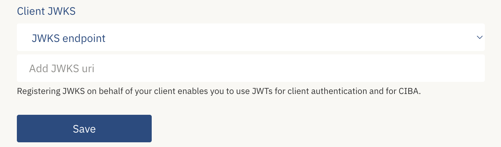

import Layout from '../../../layouts/mdx';

export default Layout;

Private Key JWT Authentication is one of the client authentication methods defined in [Open ID Connect Core Client Authentication](https://openid.net/specs/openid-connect-core-1_0.html#ClientAuthentication).
It relies on using JWT assertions signed with asymmetric key pairs for client authentication.

<Highlight icon="file-lines">

Private Key JWT Authentication (`private_key_jwt`) offers a [more secure alternative](/verify/guides/privatekey-jwt/#advantages-of-private-key-jwt-authentication) to symmetric credentials (`client_secret` authentication options)
for client authentication in [traditional server-based web applications](/verify/getting-started/oidc-intro/#using-openid-connect-to-integrate-with-criipto-verify).

</Highlight>

You can configure your [Criitp Verify Application](https://docs.criipto.com/verify/getting-started/basics/#applications) to use `private_key_jwt` for client authentication.

## Authenticate with Private Key JWT

To use `private_key_jwt` for client authentication, follow these three steps:

1. Generate an RSA key pair and a JSON Web Key Set(JWKS).

2. Build the client assertion.

3. Use the client assertion to authenticate your application against Criipto Verify.

You can use one of the recommended libraries for working with JWTs (the list is available at [jwt.io](https://jwt.io/libraries)), or leverage Criipto's [criipto-oidc-js](https://github.com/criipto/criipto-oidc-js) library. We strongly recommend utilizing an established tooling or a third-party library rather than building your own solution.

### Generate an RSA key pair and JWKS

Generate an RSA key pair and a JWKS pointing to the public key. You'll need to [add the JWKS to your Application settings](/verify/guides/privatekey-jwt/#configure-private-key-jwt-authentication) from the Dashboard later on.

<Highlight icon="exclamation">

Ideally, you would manage and expose your keys via a JWKS endpoint, but for the purposes of this guide, we will work with a static JWKSet.

</Highlight>

The code sample below uses [jose library](https://github.com/panva/jose) to generate a key pair and create a JWKS.

```javascript
import * as jose from 'jose';

async function generateKeys() {
  try {
    // Generate RSA key pair (public and private keys)
    const { publicKey, privateKey } = await jose.generateKeyPair('RS256');
    // Export the public key to JWK format
    const jwk = await jose.exportJWK(publicKey);
    const jwks = { keys: [jwk] };
    // Log the JWKS (public key in JWK Set format)
    console.log('JWK Set (Public Key):', JSON.stringify(jwks, null, 2));
    // Your private key here. Ensure to store your private key in a secure environment.
    console.log('Private Key:', privateKey);
    return { publicKey, privateKey, jwks };
  } catch (error) {
    console.error(error);
    throw error;
  }
}
```

### Build the client assertion

The client assertion is a JWT signed by the private key of the [RSA key pair](/verify/guides/privatekey-jwt/#generate-an-rsa-key-pair-and-jwks) generated earlier. It should contain the following claims:

`alg`: The algorithm used to sign the assertion. Should be set to `RS256`.

`iss`: The Client ID of your Criipto Verify application. You can find it in the General tab of your Application settings under `Client ID/Realm`.

`sub`: Your application's Client ID (the same as in the `iss` claim).

`aud`: Your Criipto Verify domain that will receive the assertion, e.g. `https://{{YOUR_CRIIPTO_DOMAIN}}.criipto.id`.

`iat` and `exp`: Issued At and Expiration claims set to the correct timestamps. The client assertion JWT should be used only once and should have a short lifespan. We recommend a maximum expiry time of 5 minutes.

#### Example

In the code sample below, the assertion is generated using the [jose library](https://github.com/panva/jose):

```javascript
const { SignJWT } = require('jose');

const signingKey = 'YOUR_SIGNING_KEY_HERE';

async function generateJWT(signingKey) {
  try {
    const jwt = await new SignJWT({})
      .setProtectedHeader({ alg: 'RS256' })
      .setIssuedAt()
      .setIssuer('CLIENT_ID')
      .setSubject('CLIENT_ID')
      .setAudience('YOUR_CRIIPTO_DOMAIN')
      .setExpirationTime('5m')
      .sign(signingKey);
    console.log('JWT:', jwt);
    return jwt;
  } catch (error) {
    console.error('Error generating JWT:', error.message);
    throw error;
  }
}
```

### Exchange the client assertion for an access token

You'll need to include the client assertion along with the verification code when performing the [code-for-token exchange](/verify/getting-started/oidc-intro/#exchange-the-code-for-a-token).

The `client_assertion_type` should be set to `urn:ietf:params:oauth:client-assertion-type:jwt-bearer`.

```curl
# Replace `$client_assertion` with your JWT assertion
# Replace `CLIENT_ID` with your Client ID
# Replace `AUTHORIZATION_CODE` with the authorization code received in the initial authorization request
# Replace `YOUR_DOMAIN.criipto.id` with your Criipto domain
# Replace `YOUR_RETURN_URL` with the redirect URI used in the initial authorization request

HTTP POST https://YOUR_DOMAIN.criipto.id/oauth2/token
Content-Type: application/x-www-form-urlencoded

grant_type=authorization_code
&client_assertion_type=urn:ietf:params:oauth:client-assertion-type:jwt-bearer
&client_assertion=$client_assertion
&code=AUTHORIZATION_CODE
&client_id=CLIENT_ID
&redirect_uri=YOUR_RETURN_URL
```

## Configure Private Key JWT Authentication

To configure Private Key JWT Authentication, you'll need to register JWKS on behalf of your client on the [management dashboard](https://dashboard.criipto.com).

In your Application settings, go to `OpenID Connect` > `Client JWKS`. You can add a static JWKS or a JWKS endpoint.



- Static: Add your static JWKS.
- JWKS Endpoint: Provide JWKS URI to fetch JWKS dynamically (recommended).

## Advantages of Private Key JWT Authentication

`private_key_jwt` offers enhanced security compared to traditional `client_secret` authentication methods by removing the need for a pre-shared symmetric key (client secret).

Instead, you generate a pair of asymmetric keys and have Criipto point to the JWKS in your system. During authentication, your application signs its request with the private key, creating a signed client assertion. Criipto Verify can then use the public key from the JWKS to decrypt and verify the assertion.

This setup also facilitates seamless key rollover.

<Highlight icon="file-lines">

With `client_secret`:

Criipto Verify generates the `client_secret`. Every time the application wants to perform client authentication, it must send the `client_secret` in order to obtain an access token.

With `private_key_jwt`:

You generate your own asymmetric key pair and register it with Criipto Verify by supplying your JWKS. Therefore, the private key is under your control and is never shared or transmitted over the network.

</Highlight>
