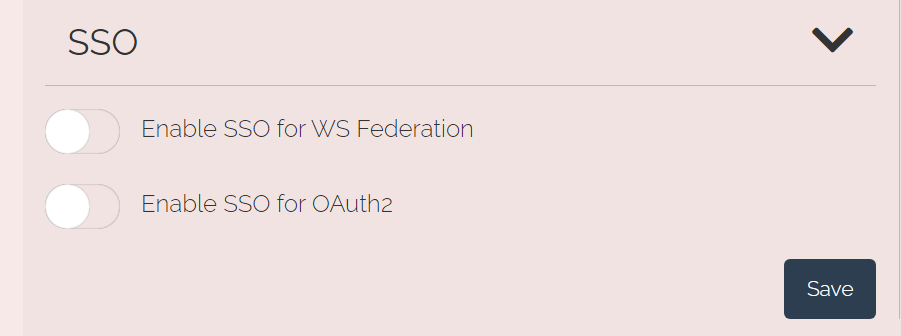

import Layout from '../../../layouts/mdx';

export default Layout;

Enabling Single Sign-On, SSO, for a Criipto Verify domain will let your users get access to several of your systems with a minimum of effort. They will only be prompted for a login once per browsing session when you are using SSO. Subsequent authentication requests on the same domain (and for the same eID method) will be completed automatically by Criipto Verify, thereby reducing the UX friction.

<Highlight icon="file-lines">

The session information needed to maintain an SSO session is maintained in `HTTP-only`, `Secure` cookies, created with `SameSite=None`. This means that the session can be established and maintained even if your users access your Criipto Verify domain in third-party context. Cookies and therefore also the SSO session is tied to a single Criipto Verify domain.

</Highlight>

## How to enable Single Sign-on

You enable and disable `SSO` per DNS domain through the management dashboard for Criipto Verify. Go to the `Domains` tab on [dashboard.criipto.com](https://dashboard.criipto.com/domains) and click on the domain you choose for SSO. The following options are available:

## Per-request options

You can tweak this behavior on a per-authentication-request basis by specifying an additional query parameter in the request for authentication. There are 2 options: 
- **Silent check**: Check if the user has an existing session. Criipto Verify will never require any user interactions in this case. You specify this by adding an extra query parameter `prompt=none`
- **Forced login**: Ignore an existing session and force a new login. You specify this option by adding an extra query parameter `prompt=login`.

If you send a `prompt=none` and the user has no session, an error response will be sent back to your supplied callback URL with an `error=login_required` value.

_Note_ that if you are using WS-Federation, and have to use a library that supports only standard parameters, you can achieve the same effect via the `wfresh` parameter. Specify `wfresh=-1` for a `Silent check` and `wfresh=0` for a `Forced login`

## Single LogOut (SLO)

If you are using SSO across multiple applications, you should also offer users a way to actively terminate the sessions with each application. Depending on the authentication protocol you use, you can initiate a _Single Logout_, SLO, flow by sending the users browser to one of the following URLs:

- OpenID Connect: `https://VERIFY_DOMAIN/oauth2/logout?post_logout_redirect_uri=a_pre-registered_callback_url`
- WS-Federation: `https://VERIFY_DOMAIN/passive/federation?wa=wsignout1.0&wreply=a_pre-registered_callback_url`

