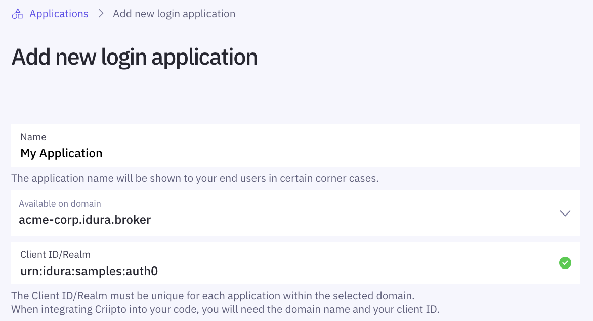
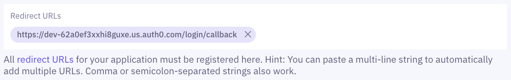

This tutorial demonstrates how to integrate Idura Verify with Auth0. The following steps are required to complete your first login:

1. [Register your Auth0 tenant in Idura Verify](#register-your-auth0-tenant-in-idura-verify)
2. [Configure OAuth2 Code Flow](#configure-the-oauth2-code-flow)
3. [Create Auth0 connections](#create-auth0-connections)
4. [Integrate your application with Auth0](#integrate-your-application-with-auth0)

In the following, you'll first configure Idura Verify, then Auth0, and finally complete the Idura Verify configuration with the information you get from Auth0. Once everything's configured, you can test your integration from Auth0.

## Register your Auth0 tenant in Idura Verify

First, create a new [application](/verify/getting-started/basics/#applications) for your Auth0 tenant in Idura Verify. This is done via the [Idura Dashboard](https://dashboard.criipto.com/applications/add?tags=authentications).



Once the application is created, you'll need some of its details for configuring Auth0 to communicate with Idura Verify. Gather the following information from the application settings:

- **Client ID** to identify your Auth0 tenant to Idura Verify. We chose `urn:idura:samples:auth0` for this example.
- **Domain** on which you will be communicating with Idura Verify. If your company name is Acme Corp, it could be, for example, `acme-corp.idura.broker`.
- **Client secret** is needed if you choose the [back-channel](/verify/getting-started/oidc-intro/#authenticate-with-back-channel-authorization-code-flow) approach. The secret is generated when you [configure OAuth2 Code Flow](/verify/integrations/auth0/#configure-oauth2-code-flow) for your application.

## Configure OAuth2 Code Flow

import CodeFlowSnippet from '../../../snippets/oauth2-code-flow.mdx';

<CodeFlowSnippet />

## Create Auth0 connections

You can leverage either an [Enterprise Connection](#enterprise-connection), or a [Custom Social Connection](#custom-social-connection) to connect Idura Verify with Auth0.

### Login-method specific endpoints

To integrate Idura Verify with Auth0, you create an Auth0 OpenID Connect(OIDC) connection to communicate with Idura Verify. Because Auth0 will not pass the `acr_values` to Idura Verify, you will have to create a new connection for every eID option that you intend to use. (`acr_values` is a parameter in the `/authorize` request to Idura Verify needed to specify which kind of eID is requested).

For those cases, you can leverage our login-method specific metadata endpoints (for [Enterprise Connections](#enterprise-connection)) and authorize URLs (for [Custom Social Connections](#custom-social-connection)). Each of these contain an embedded and base64-encoded variant of the "raw" value normally supplied in the `acr_values`.

Syntax:

- Issuer metadata endpoint: `https://yourdomain.idura.broker/BASE64(acr_values)/.well-known/openid-configuration`
- Authorize URL: `https://yourdomain.idura.broker/BASE64(acr_values)/oauth2/authorize`

For example, the `acr_values` of Norwegian BankID login method is `urn:grn:authn:no:bankid`. This translates to `dXJuOmdybjphdXRobjpubzpiYW5raWQ=` in base64 (UTF-8 charset), so the syntax will be:

- Issuer metadata endpoint: `https://yourdomain.idura.broker/dXJuOmdybjphdXRobjpubzpiYW5raWQ=/.well-known/openid-configuration`
- Authorize URL: `https://yourdomain.idura.broker/dXJuOmdybjphdXRobjpubzpiYW5raWQ=/oauth2/authorize`

#### Choose the specific login method

Below is a list of supported login methods with the corresponding base64 encoded `acr_values`. Choose the ones you intend to use.

import LoginMethodsSnippet from '../../../snippets/login-methods-and-path-encoded.mdx';

<LoginMethodsSnippet />

<hr />

### Enterprise Connection

You can connect Auth0 to Idura Verify by creating an OIDC Enterprise Connection. You create an OIDC connection for [every login method](#login-method-specific-endpoints) you intend to use.

#### Create the OIDC connection(s)

1. Go to Auth0 dashboard for your tenant and under **Authentication** choose **Enterprise**.
2. Select **OpenID Connect** and create a new connection.
3. Enter **Connection name**.
4. Under **Issuer URL** enter the login-method specific URL, as described [above](#login-method-specific-endpoints).
5. Under **Client ID** enter the **Client ID/Realm** from your Idura Verify application.
6. Copy the **Callback URL** generated by Auth0. In your Idura dashboard, open the General tab of your application settings and paste this URL into the **Redirect URLs** field.
7. Back in the Auth0 dashboard, create a connection by clicking **Create**.
8. After the connection is created, go to the **Settings** tab.
9. Choose _Front Channel_ or _Back Channel_ as a **Type**, depending on how you intend to integrate it with your application.

- you should choose _Front Channel_ only if you are developing a pure SPA application. Otherwise, choose _Back Channel_.

10. If you chose _Back Channel_ as a **Type**, enter the **Client Secret** generated by Idura Verify when you enabled the OAuth2 Code Flow.
11. Select **Save Changes**.
12. Make sure to enable the created connection for your Auth0 application.

<Highlight icon="file-lines">

After you save a connection, you may get an error: "Error! Something happened while trying to save your connection: Issuer metadata missing the following attributes: token_endpoint".

This is due to a bug in Auth0's frontend, nothing to worry about. In this case, under the **Issuer URL** select **Show Issuer Details** and under **Token Endpoint** enter `https://<YOUR COMPANY>.idura.broker/oauth2/token`

</Highlight>

<Highlight icon="file-lines">

If you are creating multiple connections, you have to enter **Callback URL** only once. It will be the same for every OpenID Connect connection.

</Highlight>

#### Test the connection

To test your OpenID Connect connection, go back to the list of all OpenID Connect connections and select **Try** button on the right side of the connection you want to test. You will need a [test user](#test-users) to perform testing.

### Custom Social Connection

Alternatively, you can leverage a <a href="https://auth0.com/docs/authenticate/identity-providers/social-identity-providers/oauth2" target="_blank">Custom Social Connection</a> to integrate with Idura Verify via OpenID Connect. Create an OIDC connection for [every login method](#login-method-specific-endpoints) you intend to use.

#### Create the OIDC connection(s)

1. Go to Auth0 dashboard for your tenant and under **Authentication** choose **Social**.
2. Select **Create Connection**, go to the bottom of the list, then choose **Create Custom**.
3. Enter **Connection name**.
4. Under **Authorization URL**, enter a [login-method specific](#login-method-specific-endpoints) [authorize URL](/verify/guides/authorize-url-builder/) to which your users will be redirected to log in to your application, e.g. `https://yourdomain.idura.broker/dXJuOmdybjphdXRobjpubzpiYW5raWQ=/oauth2/authorize?scope=openid&client_id=urn:idura:acme-corp:auth0&redirect_uri=https://jwt.io&response_type=code`
5. Under **Token URL**, enter your token endpoint: `https://yourdomain.idura.broker/oauth2/token`
6. Under **Client ID** enter the **Client ID/Realm** from your Idura Verify application.
7. Under **Client Secret** enter the **Client Secret** generated by Idura Verify when you enabled the [OAuth2 Code Flow](##configure–the-oauth2-code-flow).
8. Add the required <a href="https://auth0.com/docs/authenticate/identity-providers/social-identity-providers/oauth2#fetch-user-profile-script" target="_blank">Fetch User Profile Script</a> using your `userInfo` endpoint, e.g.:

```javascript
function fetchUserProfile(accessToken, context, callback) {
  request.get(
    {
      url: 'https://yourdomain.idura.broker/oauth2/userinfo',
      headers: {
        Authorization: 'Bearer ' + accessToken,
      },
    },
    (err, resp, body) => {
      if (err) {
        return callback(err);
      }
      if (resp.statusCode !== 200) {
        return callback(new Error(body));
      }
      let bodyParsed;
      try {
        bodyParsed = JSON.parse(body);
      } catch (jsonError) {
        return callback(new Error(body));
      }
      const profile = {
        user_id: bodyParsed.uuid,
        name: bodyParsed.name,
      };
      callback(null, profile);
    },
  );
}
```

9. Create a connection by clicking **Create**.
10. Make sure to enable the created connection for your Auth0 application.
11. Lastly, add Auth0's callback URL (`https://{{yourAuth0Domain}}/login/callback`) to the **Redirect URLs** section of your Idura Verify application settings.



#### Test the connection

Test your Custom Social Connection by clicking the **Try Connection** button located in the top right corner.

### Test users

import TestUsersSnippet from '../../../snippets/test-users-description.mdx';

<TestUsersSnippet />

## Integrate your application with Auth0

How to integrate your application with Auth0 depends on the technology you are working with. Refer to the [Auth0 quickstart guide](https://auth0.com/docs/quickstarts/) for more details.
