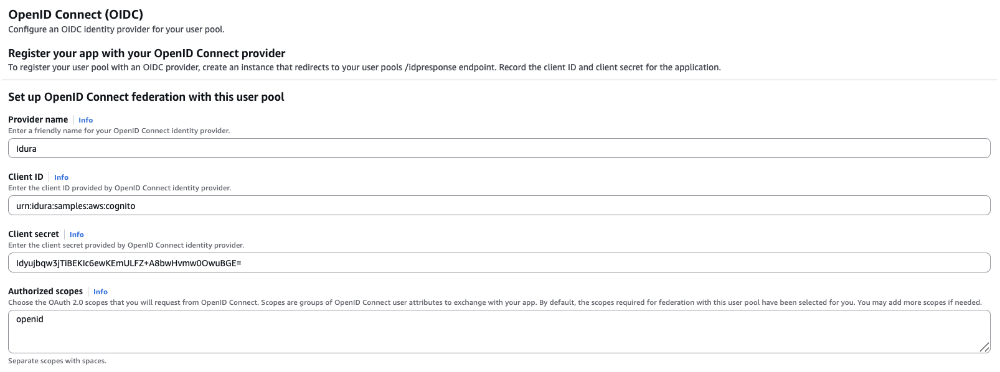
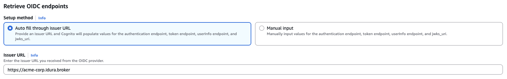

## AWS Cognito basics

Your AWS Cognito user pool must be configured **without** email as a required attribute.

Make sure you have configured an Amazon Cognito domain for your AWS Cognito user pool (in this example we picked `https://idura-samples.auth.us-east-1.amazoncognito.com`).

## Register your AWS Cognito tenant in Idura Verify

First, create a new [application](/verify/getting-started/basics/#applications) for your AWS Cognito tenant in Idura Verify. This is done via the [Idura Dashboard](https://dashboard.criipto.com/applications/add?tags=authentications).
When creating an application, register the redirect URL for your AWS Cognito Domain (`https://<your-user-pool-domain>/oauth2/idpresponse`).

Once the application is created, you'll need some of its details for configuring AWS Cognito to communicate with Idura Verify. Gather the following information from the application settings:

- **Client ID** to identify your AWS Cognito tenant to Idura Verify. We chose `urn:idura:samples:aws:cognito` for this example.
- **Domain** on which you will be communicating with Idura Verify. We used `acme-corp.idura.broker`.
- **Client secret** which AWS Cognito needs to fetch actual user information from Idura Verify during login. The secret is generated when you [configure the OAuth2 code flow](/verify/integrations/aws-cognito/#configure-the-oauth2-code-flow) for your application.

## Configure the OAuth2 code flow

import OAuth2CodeFlowSnippet from '../../../snippets/oauth2-code-flow.mdx';

<OAuth2CodeFlowSnippet />

## AWS Cognito provider setup

1. Go to your existing or newly created AWS Cognito User Pool.
2. Navigate to **Authentication** < **Social and external providers**, and click **Add identity provider**.
3. Select **OpenID Connect (OIDC)**.
4. Fill in the **Set up OpenID Connect federation with this user pool** form similar to the following example:

Assuming that your Idura Verify domain is `acme-corp.idura.broker`, configure the fields as follows:
- **Name**: A name for Idura Verify identity provider. It's entirely up to you, we used "Idura" in this example.
- **Client ID**: `urn:idura:samples:aws:cognito` (the **Client ID/Realm** value from your Idura Verify application).
- **Client secret**: The secret generated by Idura Verify during the [OAuth2 code flow setup](/verify/integrations/aws-cognito/#configure-the-oauth2-code-flow).
- **Authorized scopes**: `openid` will suffice.
- **Issuer URL**: `https://acme-corp.idura.broker` (the Idura domain your application is registered on).

5. After filling in the form, click **Add identity provider**.

## AWS Cognito application setup

1. Create a new Cognito app client or use an existing one.
2. Go to **App clients** and find your Cognito app client.
3. Navigate to **Login pages** > **Managed login pages configuration**, and click **Edit**.
4. Select "Idura" (or whatever provider name you picked for your AWS Cognito provider) as Identity provider.
5. Add a callback URL to the **Allowed callback URLs** section.
6. Set up OpenID Connect scopes.
7. Click **Save changes**.

## Perform a login

Launch the hosted UI for your AWS Cognito domain/client or perform an authorize request.

## Common errors

- `invalid token_type in idp oauth response`: Make sure the **User info response strategy** in your Idura application settings is configured as `plainJson`.
