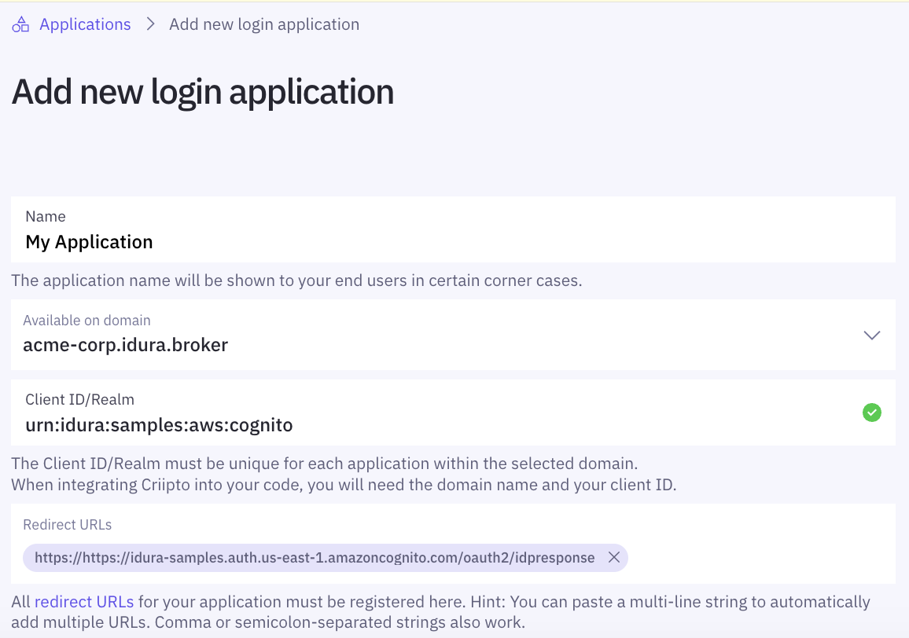
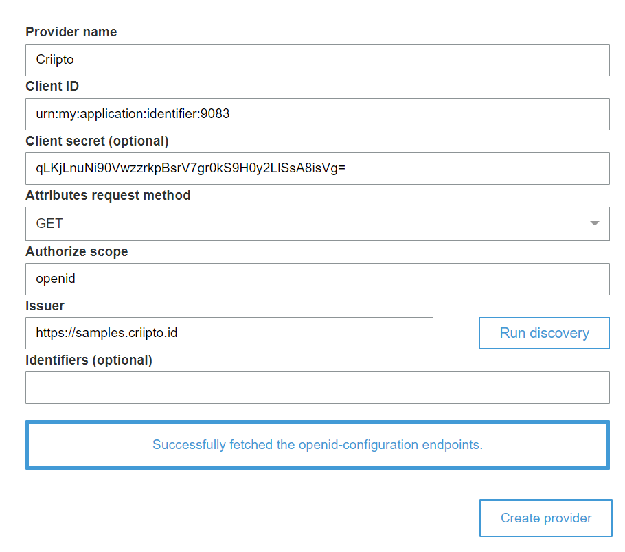
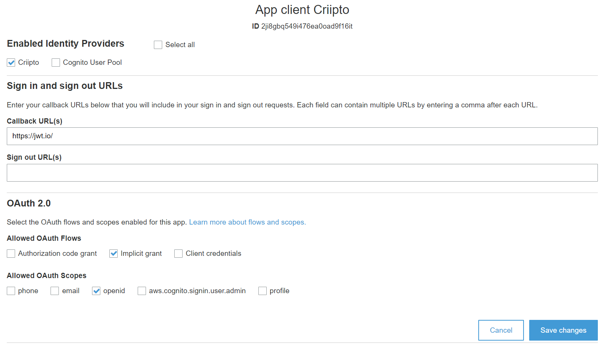

import Layout from '../../../layouts/mdx';
export default Layout;

## AWS Cognito basics

Your AWS Cognito user pool must be configured **without** email as an required attribute.

Make sure you have configured a Amazon Cognito domain for your AWS Cognito user pool (in this example we have picked `https://criipto-samples.auth.us-east-1.amazoncognito.com`)

## Register your Criipto Application

1. Login to you Criipto Verify account - [https://dashboard.criipto.com/applications/add](https://dashboard.criipto.com/applications/add)
2. Navigate to Applications
3. Click the "Add login application" button
4. Enter application name (in this example we used "AWS Cognito" and select a domain)
5. Register the callback URL for your AWS Cognito Domain (`https://<your-user-pool-domain>/oauth2/idpresponse`)
6. Enable OAuth2 Code Flow
7. Create application and make a note of your client id and client secret
8. Modify your "User info response strategy" to "plainJson" and save your application.

## AWS Cognito provider setup

1. Go to your existing or newly created AWS Cognito User Pool.
2. Go to Federation > Identity Providers
3. Click OpenID Connect
4. Enter a provider name (in this example we used "Criipto")
5. Enter your Criipto Application client id in the "Client ID" field
6. Enter your Criipto Application client secret in the "Client Secret" field
7. Enter "openid" in "Authorize scope" field
8. Enter `https://{{YOUR_CRIIPTO_DOMAIN}}` in the "Issuer" field
9. Click "Run discovery"
10. Click "Create provider"

## AWS Cognito application setup

1. Create a new Cognito app client or use an existing one.
2. Go to "App client settings" and find your Cognito app client.
3. Mark "Criipto" (or whatever provider name you picked for your AWS Cognito provider)
4. Add a callback URL to your application if you have not already
5. Setup OAuth2 scopes
6. Click "Save changes"

## Perform a login

Launch the hosted UI for your AWS Cognito domain/client or perform an authorize request.

## Common errors

- `invalid token_type in idp oauth response`: Make sure "User info response strategy" is configured as "plainJson"