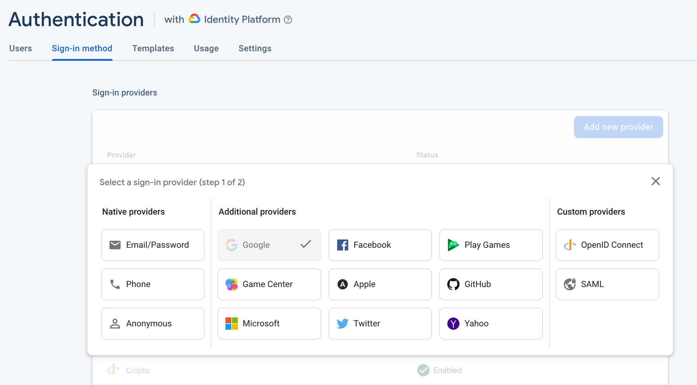
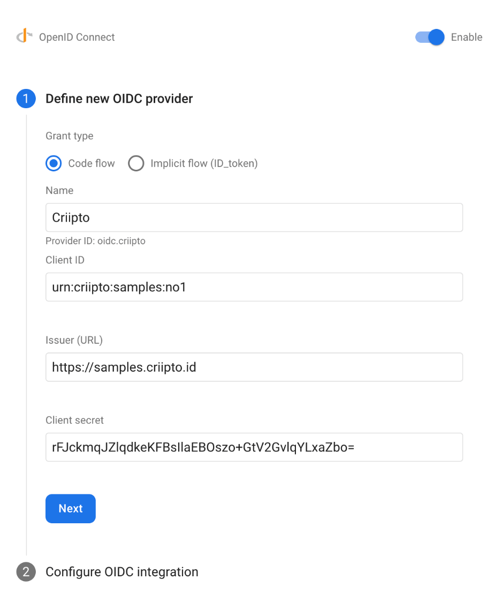
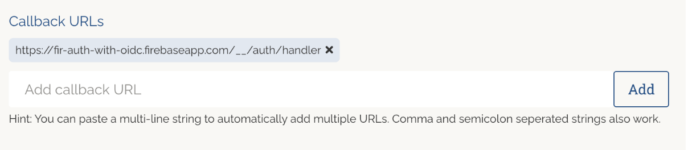

import Layout from '../../../layouts/mdx';
export default Layout;

## Firebase Authentication with OpenID Connect

Firebase provides two options for authenticating users: the simpler Firebase Auth and the more comprehensive Firebase Authentication with Identity Platform.

The Identity Platform supports OpenID Connect authentication, so you can leverage Criipto as an OpenID provider to authenticate your users in web apps, on Android, and on Apple platforms.

In the following tutorial you will first create and register your Criipto application, then configure Firebase Authentication with Identity Platform using Criipto as an OpenID Connect provider.
Finally, you will add the Callback URL from Firebase to your Criipto application.

## Register your Criipto Application

1. Login to your Criipto Verify account - [https://dashboard.criipto.com/applications/add](https://dashboard.criipto.com/applications/add)
2. Navigate to Applications.
3. Click the "Add login application" button.
4. Enter application name (in this example we used "Firebase App") and select a domain.
5. Create and save your application, and make a note of your client id.
6. After your application is created, the OpenID Connect tab and enable the OAuth2 Code Flow. Save the changes, and make a note of your application’s OAuth2 client secret.
7. Modify your "User info response strategy" to "plainJson" and save your application.

## Firebase application and OIDC provider setup

Once you register your login application at Criipto Verify, you will have access to the following information necessary for leveraging Criipto as an OpenID Connect provider in Firebase Authentication with Identity Platform:

- **Client ID** to identify your Criipto tenant to Firebase. In the case below we chose `urn:criipto:samples:no1`
- **Client Secret** is required if you choose the OAuth2 Code Flow - which we recommend.
- **Domain** that you will use as an Issuer URL in Firebase. We used `samples.criipto.id` in this example.

You can now configure Firebase Authentication with Identity Platform to use Criipto Verify as an OpenID Connect provider.
Your next steps may be slightly different depending on the platform of your choice. The steps below are mainly written for web applications.
Alternatively, you can follow Firebase documentation for [web applications](https://firebase.google.com/docs/auth/web/openid-connect), [iOS](https://firebase.google.com/docs/auth/ios/openid-connect), or [Android](https://firebase.google.com/docs/auth/android/openid-connect).

1. Create a new Firebase project or use an existing one.
2. Enable OpenID Connect as a sign-in provider for your Firebase project.
   You can do this by going to the Authentication section of your Firebase console and choosing the Sign-in method tab.
   Click the "Add provider" button and select "OpenID Connect".
   
3. You will now enable and define a new OIDC provider using the [information from your Criipto Dashboard and the Client Secret you previously saved](#firebase-application-and-oidc-provider-setup).
4. Choose the grant type you intend to use. We recommend choosing the OAuth2 Code Flow.
5. Enter a provider name (in this example we used "Criipto").
6. Enter your Criipto Application client id in the "Client ID" field.
7. Enter `https://{{YOUR_CRIIPTO_DOMAIN}}` in the "Issuer (URL)" field.
8. Enter your Criipto Application client secret in the "Client Secret" field and click "Next".
   
9. You will now configure the OIDC integration. Copy the Firebase Callback URL and add it to the "Callback URL" field in your Criipto Dashboard.
   
10. You are now ready to integrate Firebase into your application by following the steps for the platform of your choice:

    - [Web applications](https://firebase.google.com/docs/auth/web/openid-connect)
    - [iOS](https://firebase.google.com/docs/auth/ios/openid-connect)
    - [Android](https://firebase.google.com/docs/auth/android/openid-connect)

You can handle the entire sign-in flow with the Firebase SDK, or choose to handle it manually. The latter option is useful if you've already implemented one of Criipto's SDKs in your application.

### Manual setup for handling the sign-in flow

As mentioned above, you can choose the [manual setup](https://firebase.google.com/docs/auth/web/openid-connect#manual) and use the ID token directly to authenticate with Firebase.

[In `@criipto/verify-react`](/verify/integrations/react/), you can use the `id_token` property of the `result` object to retrieve the ID token after the user signed in with Criipto Verify.

```jsx
import { useCriiptoVerify } from '@criipto/verify-react';
import { getAuth, signInWithCredential, OAuthProvider } from 'firebase/auth';

const provider = new OAuthProvider('oidc.criipto');

function App() {
  const { claims, result } = useCriiptoVerify();

  // Handle Firebase sign-in flow manually
  useEffect(() => {
    if (!claims) return;
    const credential = provider.credential({
      idToken: result.id_token,
    });

    signInWithCredential(getAuth(), credential)
      .then((result) => {
        // User is signed in.
        // IdP data available in result.additionalUserInfo.profile.

        // Get the OAuth access token and ID Token
        const credential = OAuthProvider.credentialFromResult(result);
        const idToken = credential.idToken;
      })
      .catch((error) => {
        // Handle error.
      });
  }, [claims, result]);

  // ... render your component
}
```

[Using `@criipto/auth-js`](/verify/integrations/javascript/) with redirect authorization, you can use the resulting ` id_token` from the `match()` call to pass to Firebase.

```jsx
import { getAuth, signInWithCredential, OAuthProvider } from 'firebase/auth';

const provider = new OAuthProvider('oidc.criipto');
const match = await criiptoAuth.match();

const credential = provider.credential({
  idToken: match.id_token,
});

signInWithCredential(getAuth(), credential)
  .then((result) => {
    // User is signed in.
    // IdP data available in result.additionalUserInfo.profile.

    // Get the OAuth access token and ID Token
    const credential = OAuthProvider.credentialFromResult(result);
    const idToken = credential.idToken;
  })
  .catch((error) => {
    // Handle error.
  });
```
