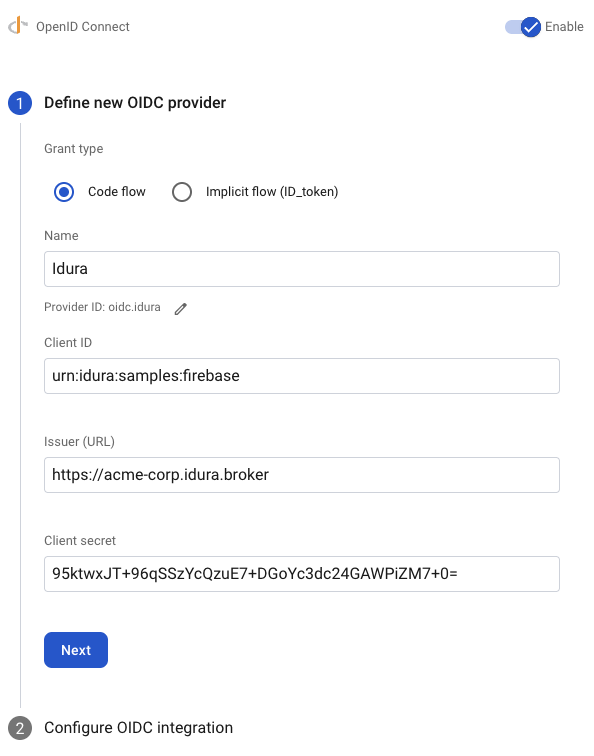
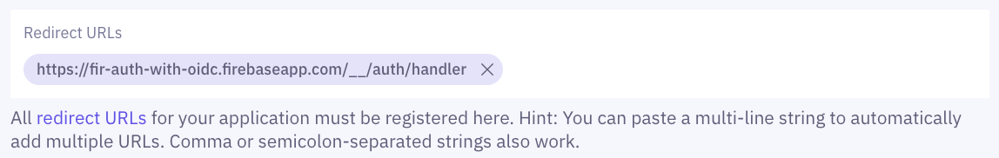

## Firebase Authentication with OpenID Connect

Firebase provides two options for authenticating users: the simpler Firebase Auth and the more comprehensive Firebase Authentication with Identity Platform.

The Identity Platform supports OpenID Connect authentication, so you can leverage Idura as an OpenID provider to authenticate your users in web apps, on Android, and on Apple platforms.

In the following tutorial you will first create and register your Idura application, then configure Firebase Authentication with Identity Platform using Idura as an OpenID Connect provider.
Finally, you will add the Callback URL from Firebase to your Idura application.

## Register your Idura Application

1. Log in to your [Idura Verify account](https://dashboard.criipto.com).
2. Navigate to **Applications**.
3. Click the **Add application** button, and select **Authentications** as application type.
4. Enter your application name and select a domain.
5. Save your application, and make a note of the **Client ID**.
6. After your application is created, open the **OpenID Connect** tab in the application settings and enable the **OAuth2 Code Flow**. Save the changes, and make a note of your application’s **Client Secret**.
7. In the **OpenID Connect** tab, modify your **User info response strategy** to **plainJson** and save the application.

## Firebase application and OIDC provider setup

Once you register your application at Idura Verify, you will have access to the following information necessary for leveraging Idura as an OpenID Connect provider in Firebase Authentication with Identity Platform:

- **Client ID** to identify your Idura tenant to Firebase. We'll use `urn:idura:samples:firebase` for this example.
- **Client Secret** is required if you use the **OAuth2 Code Flow** - which we recommend.
- **Domain** that you will use as an Issuer URL in Firebase. We'll use `acme-corp.idura.broker`.

You can now configure Firebase Authentication with Identity Platform to use Idura Verify as an OpenID Connect provider.
Your next steps may be slightly different depending on the platform of your choice. The steps below are written mainly for web applications.
Alternatively, you can follow Firebase documentation for [web applications](https://firebase.google.com/docs/auth/web/openid-connect), [iOS](https://firebase.google.com/docs/auth/ios/openid-connect), or [Android](https://firebase.google.com/docs/auth/android/openid-connect).

1. Create a new Firebase project or use an existing one.
2. Enable OpenID Connect as a sign-in provider for your Firebase project.
   You can do this by going to the **Authentication** section of your Firebase console and choosing the **Sign-in method** tab.
   Click **Add new provider**, then select **OpenID Connect**.
   
3. You will now enable and define a new OIDC provider using the [information from your Idura Dashboard and the Client Secret you previously saved](#firebase-application-and-oidc-provider-setup).
4. Choose the **Grant type** you intend to use. We recommend choosing **Code flow**. _For more information, see [OpenID Connect best security practices](/verify/getting-started/best-security-practices/#authorization-code-flow)._
5. Enter a provider name – this is entirely up to you. We used "Idura" in this example.
6. Enter your Idura Application **Client ID** in the **Client ID** field.
7. Enter your Idura domain in the **Issuer (URL)** field (e.g., `https://acme-corp.idura.broker`).
8. Enter your Idura Application **Client Secret** in the **Client Secret** field and click **Next**.
   
9. You will now configure OIDC integration. Copy the Firebase **Callback URL** and add it to the **Redirect URLs** field of your Idura Verify application settings.
   
10. You are now ready to integrate Firebase into your application by following the steps for the platform of your choice:
    - [Web applications](https://firebase.google.com/docs/auth/web/openid-connect)
    - [iOS](https://firebase.google.com/docs/auth/ios/openid-connect)
    - [Android](https://firebase.google.com/docs/auth/android/openid-connect)

You can handle the entire sign-in flow with the Firebase SDK, or choose to handle it manually. The latter option is useful if you've already implemented one of Idura's SDKs in your application.

### Manual setup for handling the sign-in flow

As mentioned above, you can choose the [manual setup](https://firebase.google.com/docs/auth/web/openid-connect#manual) and use the ID token directly to authenticate with Firebase.

For instance, if you're working with our [React SDK](/verify/integrations/react/), you can use the `id_token` property of the `result` object to retrieve the ID token after the user signed in with Idura Verify.

```jsx
import { useCriiptoVerify } from '@criipto/verify-react';
import { getAuth, signInWithCredential, OAuthProvider } from 'firebase/auth';

const provider = new OAuthProvider('oidc.criipto');

function App() {
  const { claims, result } = useCriiptoVerify();

  // Handle Firebase sign-in flow manually
  useEffect(() => {
    if (!claims) return;
    const credential = provider.credential({
      idToken: result.id_token,
    });

    signInWithCredential(getAuth(), credential)
      .then(result => {
        // User is signed in.
        // IdP data available in result.additionalUserInfo.profile.

        // Get the OAuth access token and ID Token
        const credential = OAuthProvider.credentialFromResult(result);
        const idToken = credential.idToken;
      })
      .catch(error => {
        // Handle error.
      });
  }, [claims, result]);

  // ... render your component
}
```

And in case of the [JavaScript SDK](/verify/integrations/javascript/) with redirect authorization, you can use the resulting `id_token` from the `match()` call to pass to Firebase.

```jsx
import { getAuth, signInWithCredential, OAuthProvider } from 'firebase/auth';

const provider = new OAuthProvider('oidc.criipto');
const match = await criiptoAuth.match();

const credential = provider.credential({
  idToken: match.id_token,
});

signInWithCredential(getAuth(), credential)
  .then(result => {
    // User is signed in.
    // IdP data available in result.additionalUserInfo.profile.

    // Get the OAuth access token and ID Token
    const credential = OAuthProvider.credentialFromResult(result);
    const idToken = credential.idToken;
  })
  .catch(error => {
    // Handle error.
  });
```
