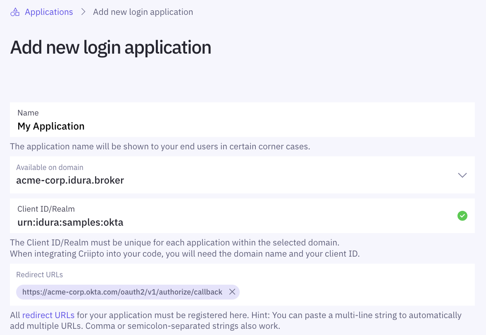
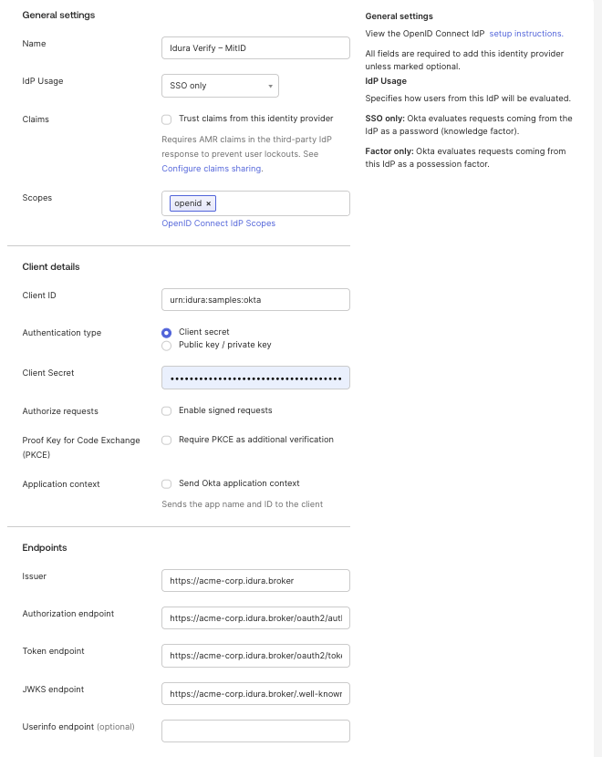

This tutorial demonstrates how to integrate Idura Verify with Okta. The following steps are required to complete your first login:

1. [Register your Okta tenant in Idura Verify](#register-your-okta-tenant-in-idura-verify)
2. [Configure your OAuth2 flow](#configure-the-oauth2-code-flow)
3. [Create Idura Verify identity provider in Okta](#create-okta-identity-provider)
4. [Integrate your application with Okta](#integrate-your-own-application-with-okta)

In the following you will be configuring first Idura Verify, then Okta.
Once configured, you may test that everything works from Okta.

The setup requires a bit of switching back-and-forth between Idura and Okta's respective management dashboards, so we recommend that you have them open simultaneously to make the process really smooth.

Before you get started, you will need the following information:

- The callback URL for your Okta tenant - this will depend on the DNS name you use in Okta for running your logins. The value might look something like `https://your-company-name.okta.com/oauth2/v1/authorize/callback`, but check your Okta settings to make sure. We'll use `acme-corp` as a replacement for `your-company-name` in this tutorial.
- _[Optional]_ The `post_logout_redirect_url` for your Okta tenant.

## Register your Okta tenant in Idura Verify

First, create a new [application](/verify/getting-started/basics/#applications) for your Okta tenant in Idura Verify. This is done via the [Idura Dashboard](https://dashboard.criipto.com/applications/add?tags=authentications).

Once the application is created, you'll need some of its details for configuring Okta to communicate with Idura Verify. Gather the following information from the application settings:

- **Client ID** to identify your Okta tenant to Idura Verify. We chose `urn:idura:samples:okta` for this example.
- **Domain** on which you will be communicating with Idura Verify. We used `acme-corp.idura.broker`.
- **Client secret** which Okta needs to fetch actual user information from Idura Verify during login. The secret is generated when you [configure the OAuth2 code flow](/verify/integrations/okta/#configure-the-oauth2-code-flow) for your application.

If you plan on using [single sign-on](/verify/guides/sso/), you must also register your Okta `post_logout_redirect_url` as a redirect URL in your Idura application, so you can run single logouts.

## Configure the OAuth2 code flow

import OAuth2CodeFlowSnippet from '../../../snippets/oauth2-code-flow.mdx';

<OAuth2CodeFlowSnippet />

### Add a new Identity Provider in Okta

<Highlight icon="file-lines">

These steps are based on [Okta developer documentation](https://developer.okta.com/docs/guides/add-an-external-idp/openidconnect/configure-idp-in-okta/) for configuring an OIDC Identity Provider.

</Highlight>

1. In your Okta Admin Console, go to **Security** > **Identity Providers**.
2. Select **Add Identity Provider**, then select **OpenID Connect IdP**. Click **Next**.
3. Fill in the **Configure OpenID Connect IdP** form similar to the following example:

Assuming that your Idura Verify domain is `acme-corp.idura.broker`, configure the fields as follows:

1. **Name**: A name for Idura Verify identity provider. It's entirely up to you.
2. **Scopes**: `openid` will suffice.
3. **Client ID**: `urn:idura:samples:okta` (the **Client ID/Realm** value from your Idura Verify application).
4. **Client Secret**: The secret generated for you by Idura Verify during the [OAuth2 code flow](/verify/integrations/okta/#configure-the-oauth2-code-flow) setup.
5. **Issuer**: `https://acme-corp.idura.broker/` (the Idura domain your application is registered on).
6. **Authorization endpoint**: `https://acme-corp.idura.broker/oauth2/authorize?acr_values=urn:grn:authn:dk:mitid:substantial`
7. **Token endpoint**: `https://acme-corp.idura.broker/oauth2/token`
8. **JWKS endpoint**: `https://acme-corp.idura.broker/.well-known/jwks`
9. **Userinfo endpoint**: `https://acme-corp.idura.broker/oauth2/userinfo`; If you specify the optional **Userinfo endpoint**, make sure your Idura Verify application [user info response strategy](/verify/integrations/okta/#configure-the-oauth2-code-flow) is set to `plainJson`.

<Highlight icon="file-lines">

This setup assumes you are planning to authenticate your users with the [Danish MitID](/verify/e-ids/danish-mitid/). If you need other eIDs, replace the value of the `acr_values` parameter in the **Authorization endpoint**, or set up several **Identity Providers** in your Okta tenant - see below for a list of supported values.

</Highlight>

### Supported acr_values

import LoginMethodsSnippet from '../../../snippets/login-methods.mdx';

<LoginMethodsSnippet />

### Test users

import TestUsersSnippet from '../../../snippets/test-users-description.mdx';

<TestUsersSnippet />

## Integrate your own application with Okta

How to integrate your application with Okta depends on the technology you are working with. Refer to the [Okta developer documentation](https://developer.okta.com/docs/) for more details.
