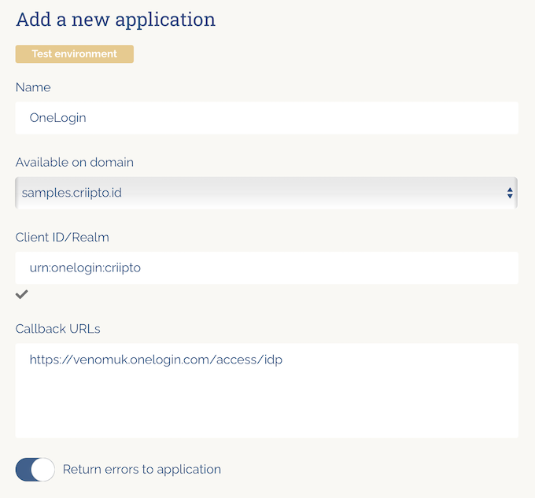
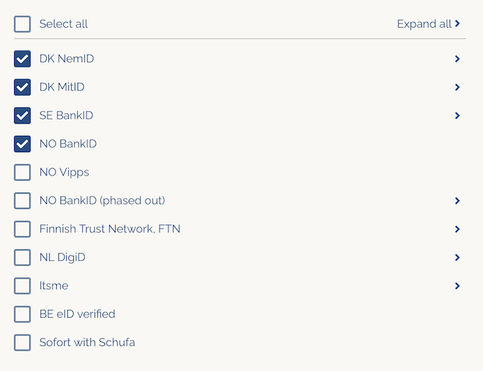
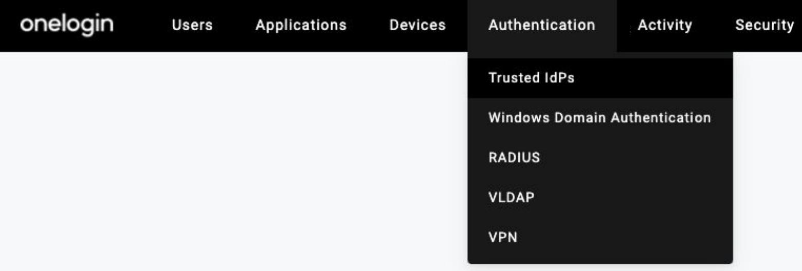
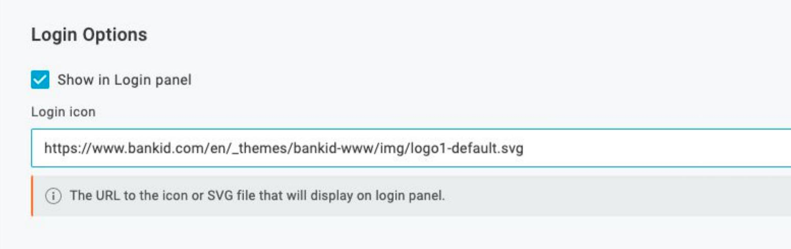
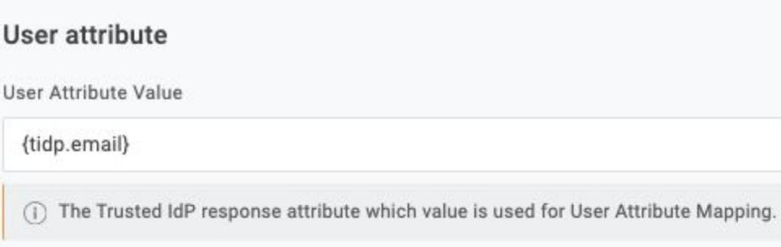

This tutorial demonstrates how to integrate Criipto Verify with OneLogin. The following steps are required to complete your first login:

1. [Register your OneLogin tenant in Criipto Verify](#register-your-onelogin-tenant-in-criipto-verify)
2. [Configure the OAuth2 flow](#configure-the-oauth2-flow)
3. [Create a OneLogin Trusted IDP for Criipto Verify](#create-a-onelogin-trusted-idp-for-criipto-verify)

## Register your OneLogin tenant in Criipto Verify

1. Login to you Criipto Verify account - [https://dashboard.criipto.com/applications/add](https://dashboard.criipto.com/applications/add)
2. Navigate to Applications
3. Select the `+` sign to add a new application
4. Provide the necessary information on the Register Application Screen

- A name for the application. For this example OneLogin has been chosen.
- Select the relevant domain from the `Available on domain` section. This will be the domain used to communicate to OneLogin. If you only subscribe to one Criipto Verify domain, only one will be listed.
- Add a Client ID/Realm to identify the OneLogin Tenant in Criipto Verify. In this example `urn:onelogin:criipto` has been assigned.
- Add the applicable Callback URL for you OneLogin tenant in the format of `https://<SUBDOMAIN>.onelogin.com/access/idp`.
- Choose the relevant legal/bank identities you would like to integrate.
- Once you are happy to proceed select `Save`.

A completed application registration will look as follows:

## Configure the OAuth2 flow

1. Navigate to applications
2. Select the application configured in the previous section
3. Scroll down to the OpenID Connect application section and enable `Enable OAuth2 Code Flow` by selecting the corresponding toggle:
   
4. Click `Save`
5. The client secret will be displayed - This will be needed when configuring the Trusted IDP within OneLogin. Please note this is the only time the client secret will be displayed. Criipto only stores the client secret as a hashed value, meaning it can not be retrieved again once generated and stored.
   
6. Leave remaining settings as default.

## Create a OneLogin Trusted IDP for Criipto Verify

1. Authenticate to the OneLogin admin console with an appropriate administrative account.
2. Navigate to Authentication -> Trusted IDPs
   
   Please note: For additional information on OneLogin Trusted IDP please refer to the [Trusted IDP knowledge base article](https://onelogin.service-now.com/kb_view_customer.do?sysparm_article=KB0010318)
3. Select `New Trust` from the top right
4. Provide an appropriate name.
   Please Note: For each legal/bank identity that needs to be integrated with OneLogin, a separate Trusted IDP needs to be configured. For the purposes of this documentation NO Bank ID, will be used as the example.
5. In the Login Options section, if you wish to represent this Trusted IdP as an authentication option on the tenant’s login page via an icon, then check Show in Login panel and provide a url to a suitable icon. (Note: websites typically host a “favicon.ico” file that could be used e.g. https://www.onelogin.com/favicon.ico)
   In the example of NO BankID, [https://www.bankid.com/en/\_themes/bankid-www/img/logo1-default.svg](https://www.bankid.com/en/_themes/bankid-www/img/logo1-default.svg) can be used
   
6. In the Configurations section, enter the Issuer URL. This will be the domain chosen during the Criipto Verify signup process.

- To review your domain in Criipto Veirfy navigate to Domains from the admin console and be sure to prefix `https://`

7. (OPTIONAL) The Email Domains field is used to automatically invoke this Trusted IdP when a user enters their email address at login time - if the email address is unrecognized, but belongs to one of the domains listed, then this TIdP will be invoked via an authentication request. This setting can be left blank if invoking this Trusted IDP from the OneLogin login panel is the preferred method.
8. Check `Sign Users into OneLogin` and deselect `Sign Users into additional applications`.
9. Scroll down to the protocol section select `OIDC` from the dropdown
10. Add `{tidp.email}` in the User Attribute Value in the User Attribute section or whatever is applicable to your use case. This is the attribute used for User attribute matching.
    
11. Select Email for User Attribute Mapping or the value applicable to your use case.
12. (OPTIONAL) Allowed Email Domains is a whitelist. This allows the administrator to restrict the acceptable email domains for inbound identities. If empty, there is no restriction.
13. The authentication endpoint syntax is as follows

- `https://<Criipto Verify Domain Name>/<base64 encoded acr value for legal/bank id being configured>/oauth2/authorize`
- To identify what the base64 encoded acr value for legal/bank id being configured, please use [Supported login methods table](#loginmethods)
- Therefore, in this example of Norwegian BankID the following issuer will be used: `https://onelogintest-test.criipto.id/dXJuOmdybjphdXRobjpubzpiYW5raWQ=/oauth2/authorize`

14. Select BASIC as the Token Endpoint Auth. Method.
15. Add the relevant token endpoint. The Token Endpoint syntax would be: `https://<Criipto Verify Domain Name>/oauth2/token`
16. Add the user information endpoint in the User Information Endpoint section. The user information endpoint syntax would be: `https://<Criipto Verify Domain Name>/oauth2/userinfo`
17. Add the relevant scopes in the scopes section. At a minimum `openid` must be used.
18. Add the client ID specified in step 4 of the [Registration of the OneLogin tenant in Criipto Verify](#register) to the Client Id section.
19. Add the Client Secret in the Client Secret section as noted in step in step 6 of [Configure the OAuth2 flow](#enable).
20. Lastly In the Trusted IdP Settings tab, head to the top of the page and check `Enable Trusted IDP` in the Enable/Disable field.

## Supported login methods

import LoginMethodsSnippet from '../../../snippets/login-methods-and-path-encoded.mdx';

<LoginMethodsSnippet />

## Test users

import TestUsersSnippet from '../../../snippets/test-users-description.mdx';

<TestUsersSnippet />
