import Layout from '../../../layouts/mdx';
export default Layout;

This tutorial demonstrates how to integrate Criipto Verify with PingFederate. The following steps are required to complete your first login:

1. [Prepare an application in Criipto Verify that represents your PingFederate tenant](#prepare-criipto-verify-application)
2. [Create an authentication source in your PingFederate tenant which connects to the Criipto Verify application](#create-pingfederate-authentication-source)
3. [Complete the application configuration in Criipto Verify](#complete-the-application-configuration-in-criipto-verify)
4. [Integrate your own application with PingFederate](#integrate-your-own-application-with-pingfederate)

In the following you will be configuring first Criipto Verify, then PingFederate, and then back to finalizing the configuration in Criipto Verify.

The final step in this excercise is needed because of a catch-22 between the requirements of the configuration steps on the two platforms, respectively:
 - Creating an application in Criipto Verify requires you to specify a callback URL to PingFederate before you can save the application configuration and get your hands on the generated client secret.
 - Getting the callback URL to PingFederate requires that you create an authentication source, which in turn requires the client secret from Criipto Verify, but you don't have the secret yet because you need the callback URL `[deadlock detected]`

which _is_ a bit of a chicken-and-egg-problem, unfortunately. We suggest that you break the deadlock by configuring a temporary (bogus) callback URL in the first step in Criipto Verify, and then replace it with the actual value available after the authentication source is created.

As the setup requires some switching back-and-forth between Criipto and PingFederate's respective management dashboards, we recommend that you have them open simultaneously to make the process fairly smooth.

Once configured you may test that everything works from PingFederate's `OAuth Playground`.

## Prepare Criipto Verify application

First, you must register your PingFederate tenant as an application in Criipto Verify.

Once you register your PingFederate tenant, you will also need some of the information for configuring PingFederate to communicate with Criipto Verify. You get these details from the settings of the application in the dashboard.

Specifically you need the following information to integrate with PingFederate:

- _Client ID_ to identify your PingFederate tenant to Criipto Verify. In the case below we chose `urn:criipto:verify`
- _Domain_ on which you will be communicating with Criipto Verify. Could be for example `samples.criipto.id`
- _Client secret_ which PingFederate needs to fetch actual user information from Criipto Verify during login.
The secret is generated when you save the new application.

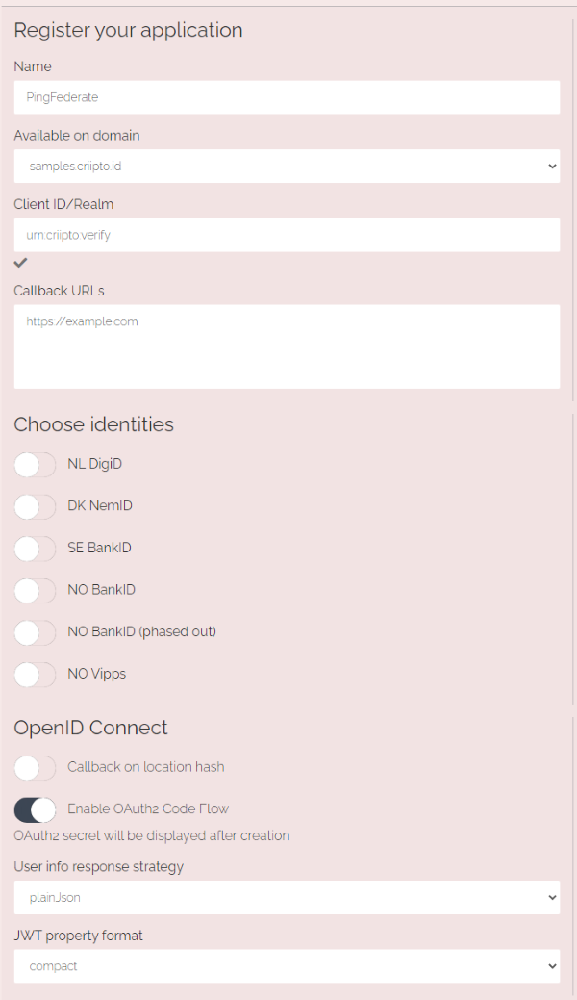

Click the **Save** button - and a popup will appear after a little while with your client secret.
Make a copy of it (preferably by pasting it directly into your PingFederate authentication source configuration).

The application details pane will be hidden automatically - you can expand it again by clicking anywhere on the line item with the name of your new application (in this article, that would be `PingFederate`).

## Create PingFederate authentication source

On the dashboard of your PingFederate tenant, go to the `Authentication` tab and click on the `IdP Connections` tile

Click the **Create Connection** button and choose `BROWSER SSO PROFILES` in `Connection Type` and then `OpenID Connect` in the `PROTOCOL` dropdown

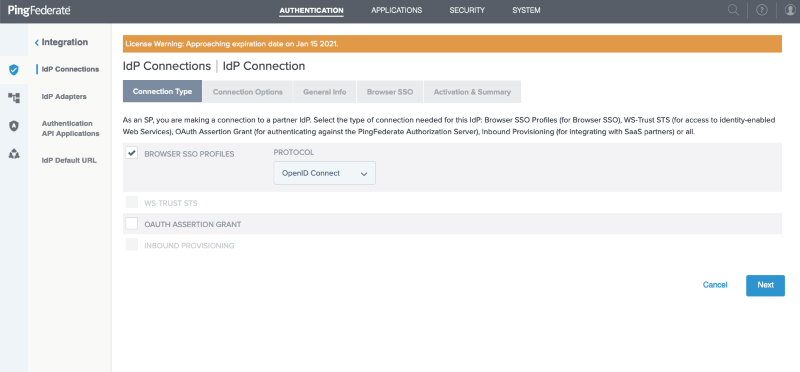

Click the **Next** button, choose `BROWSER SSO` in `Connection Options`

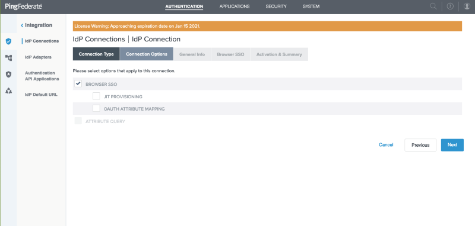

Click the **Next** button, enter your specific _Domain_ authority in the `ISSUER` field and click the **Load Metadata** button

Give the connection a recognizable name, copy-paste the _Client ID_ and _Client secret_ values from your Criipto Verify application

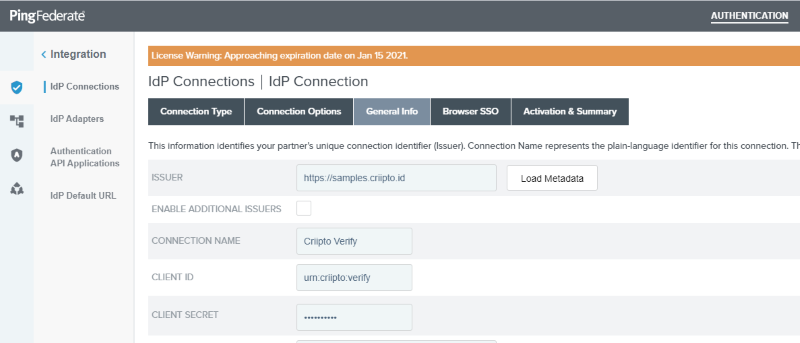

Click the **Next** button and then click the **Configure Browser SSO** button

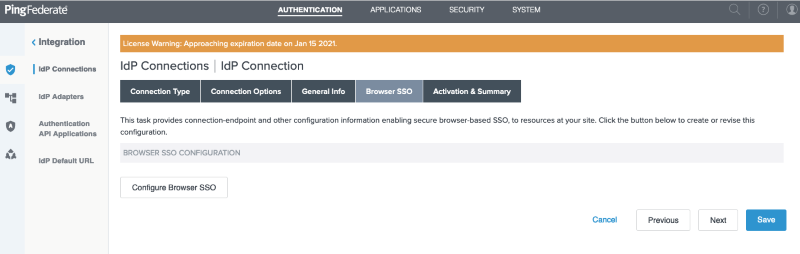

Choose `NO MAPPING` for the `Identity Mapping`

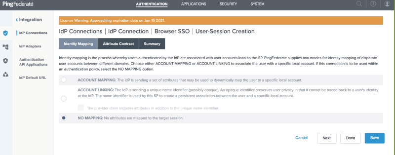

Click the **Next** button and add the claim types that you want to consume in the `Attribute Contract`

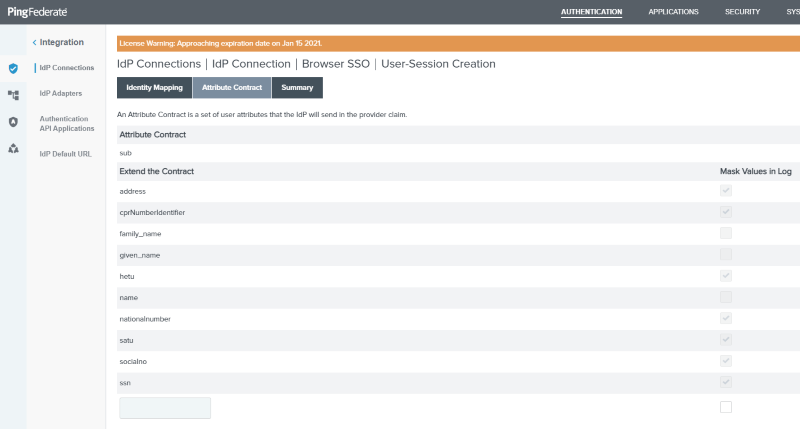

You can find the available claim types [here](/getting-started/token-contents).

Click the **Save** button and the callback URL you need to finalize the Criipto Verify application configuration is displayed - in PingFederate terms, though, the callback URL is called a `Redirect URI`.

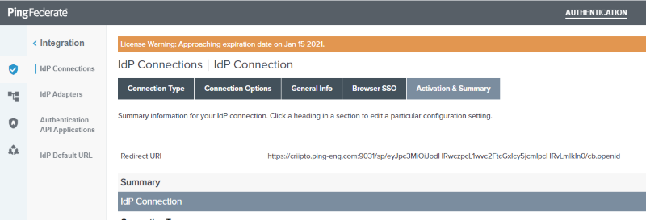

## Complete the application configuration in Criipto Verify

Expand the details of the application configuration if you haven't already done so in the first step.

Replace the temporary callback URL (from step 1, `https://example.com` in this article) in your Criipto Verify application with the actual value now available from your PingFederate authentication source configuration (the value of the `Redirect URI` above)

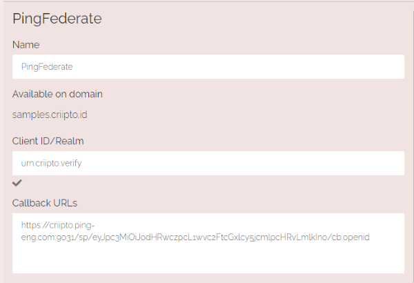

and click the **Save** button.

<Highlight icon="file-lines">

  If you plan on using single-signon, you must also register your PingFederate `post_logout_redirect_url` here so you can run single-logouts.

</Highlight>

## Integrate your own application with PingFederate

How to integrate your application with PingFederate depends on the technology you are working with. Refer to the [PingFederate developer documentation](https://developer.pingidentity.com/en/cloud-software/pingfederate.html) for more details.

If you want to use pass-through of `login_hint` values sent from your own application to Criipto Verify via PingFederate, you must enable it via a `Policy` in your `IDP AUTHENTICATION POLICIES`.

If you haven't already done so, create a `Policy Contract` with the attributes you wish to consume

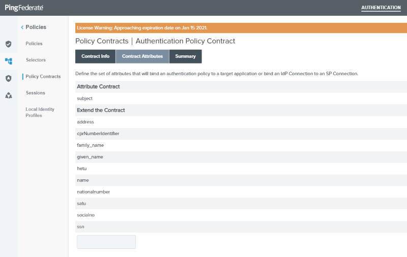

- available claim types can be found [here](/verify/e-ids)

Then create a `Policy` for your `IdP Connection` to Criipto Verify and set the `Options` for `Incoming User ID` to be sourced from `Context` and use the `Requested User` value.

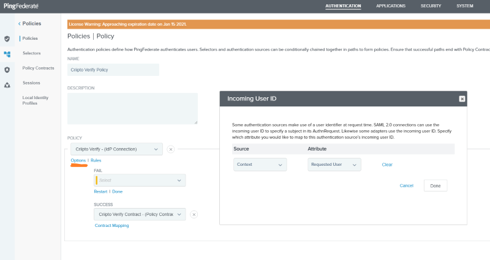

<Highlight icon="file-lines">

  You can read more about which per-authorize-request parameters you can use to control the runtime behavior of Criipto Verify [here (prefilled fields)](/verify/guides/prefilled-fields) and [here (acr_values)](/how-to/choose-eid-method#login-hint-embedded).

  Leveraging these features makes you authentication source setup in PingFederate as simple as possible - you just need to register Criipto Verify once, and reuse it for all the eID methods you need to consume.

</Highlight>
