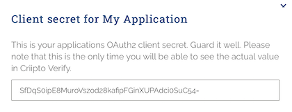
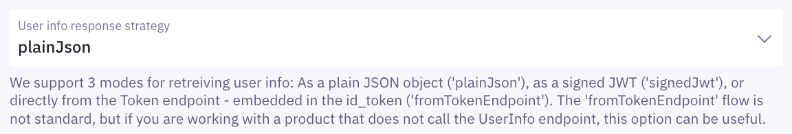
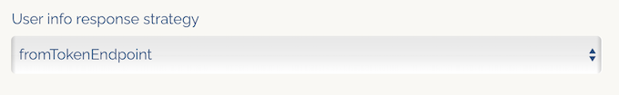

If you are registering a new application, please save the initial configuration first.

After saving, you can configure the OAuth2 Code Flow for this application by following the three steps:

1. Go to the **OpenID Connect** section of your Application settings and **Enable OAuth2 Code Flow**.
   
2. Copy the generated client secret. _Note that this is the only time you will be shown the actual value of the client secret. Criipto only stores this as a hashed value, which means you cannot retrieve the value once it has been generated and stored._
   
3. Set the user info response strategy to `plainJson` to enable retrieval of plain JSON user information from the `/oauth2/userinfo` endpoint.
   
   _Note that some libraries do not support the final `userinfo` request. In those cases, you will need to fetch the user data directly from the `token` endpoint as opposed to the `userinfo` endpoint._ You can do this by choosing `fromTokenEndpoint` as a `User info response strategy`. 
   

 

<Highlight icon="file-lines">

Criipto Verify supports four modes for retrieving user information:

- Plain JSON object (`plainJson`): User information is returned from the `userinfo` endpoint as a standard JSON object.
- Signed JWT (`signedJwt`): User information is returned from the `userinfo` endpoint as a digitally signed [JSON Web Token](/verify/getting-started/glossary/#jwt-json-web-token).
- Signed and encrypted JWT (`signedAndEncryptedJwt`): User information is returned from the `userinfo` endpoint as a signed and encrypted [JSON Web Encryption(JWE)](/verify/getting-started/glossary/#json-web-encryption-jwe) object.
- Directly from the `token` endpoint, embedded in the `id_token` (`fromTokenEndpoint`). _The `fromTokenEndpoint` flow is not standard, but can be useful if you are working with a product that does not call the `userinfo` endpoint._

</Highlight>